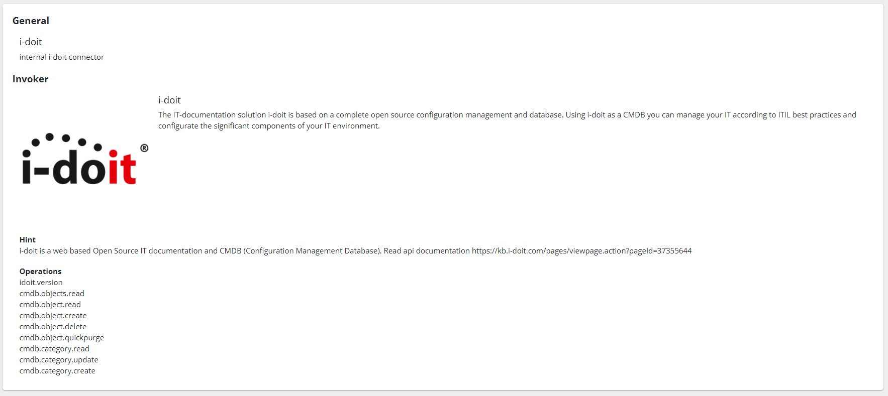

##################
Connectors
##################

Connector is a core component in Open Celium. It is a system to which we
will send requests and get responses. They can be different throw
different protocols: HTTP, JSON-RPC, SOAP, and so on. Currently, HTTP
and JSON-RPC are available. Connector uses invokers. Invoker is a
special file filled in with instructions.

Each item of the connector's list displays a title and an icon.

|image0|

Viewing the connector you can read a description of the connector itself
and information about invoker to which it was assigned, like: title,
description, hint, and operations.

|image1|

Adding/Updating connector consists of two steps: general data, and
credentials. General data step has four input fields: *title*,
*description*, *invoker* and *icon*. The *title* and *invoker* are required
fields. The *icon* can be unset setting checkbox as uncheck.

|image2|

Credentials step has several input fields. We need this step to set up a
connection to the system that describes invoker. A type of field
depends on the chosen invoker. Different invokers have different
authentication systems, that are described inside of the invoker. All
fields usually are required. If the invoker has a *password* field, you
can click on the checkbox on the right to see what you are typing
instead of asterix. Before adding/updating you test the connection. If
it was completed successfully you can finish the process.

|image3|

.. |image0| image:: ../img/connector/0.png
   :align: middle

.. |image2| image:: ../img/connector/2.png
   :align: middle
.. |image3| image:: ../img/connector/3.png
   :align: middle
