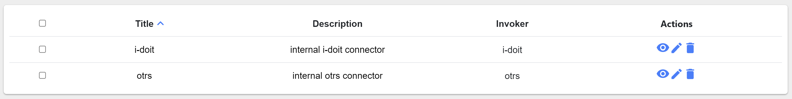
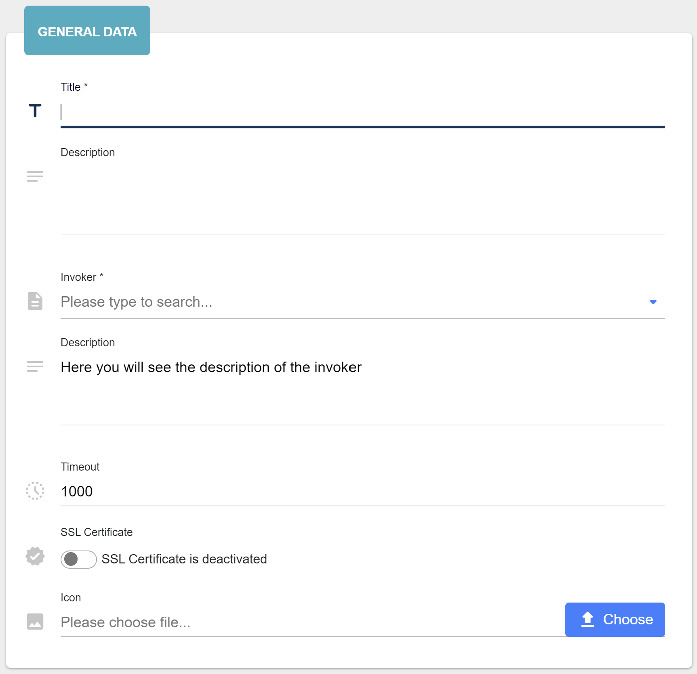

##################
Connectors
##################

Connector is a core component in OpenCelium. It is a system to which we
will send requests and get responses. They can be different throw
different protocols: HTTP, JSON-RPC, SOAP, and so on. Currently, HTTP
and JSON-RPC are available. Connector uses invokers. Invoker is a
special file filled in with instructions.

Each item of the connector's list displays a title and an icon. The grid
view provides also description and invoker name.

|image0|

Viewing the connector you can read a description of the connector itself
and information about invoker to which it was assigned, like: title,
description, hint, and operations.

|image1|

The *title* you can change directly inline double clicking on its text.

|image6|

Adding/Updating connector consists of two steps: general data and
credentials. General data step has four input fields: *title*,
*description*, *invoker*, *invoker description*, *timeout*, *ssl certificate* and *icon*.
The *title* and *invoker* are required fields. The *timeout* is a
timeout for connection; has a default value equals to 1000.
The *ssl certificate* flag enables/disables the secure protocol; disabled as a default.

|image2|

Credentials step has several input fields. We need this step to set up a
connection to the system that describes invoker. A type of field
depends on the chosen invoker. Different invokers have different
authentication systems, that are described inside of the invoker. All
fields usually are required. If the invoker has a *password* field, you
can click on the checkbox on the right to see what you are typing
instead of asterix. Before adding/updating you test the connection. If
it was completed successfully you can finish the process.

|image3|

After filling all data you can test your credential data pressing on the
*Test* button. If it is failed, you will be notified.

|image4|

After adding a connector you will be redirected to the list. You can also
press on *Add & Go to Add Connection*, if you want to be redirected to the
create connection page. The adding can be easily canceled and drive you
to the list pressing on the *cancel* button.

|image5|

.. |image1| image:: ../img/connector/1.png

.. |image3| image:: ../img/connector/3.png
   :align: middle

