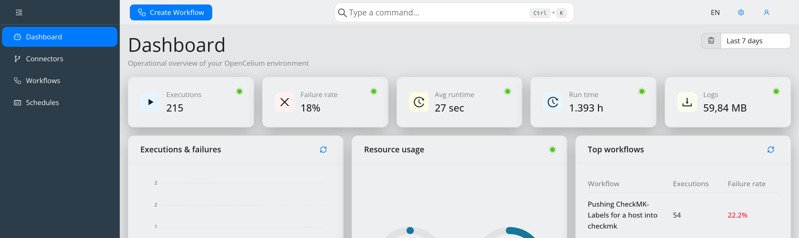

##################
Dashboard
##################

.. contents::
   :local:

The dashboard is the first screen after signing in and gives an *operational
overview of your OpenCelium environment*. 5.0 replaced the configurable widget
board of earlier versions with a fixed, purpose-built layout that is fed by the
backend and by a live metrics socket.

Live data
"""""""""

System metrics stream over the WebSocket connection, so the numbers update
without reloading. Each metric tile carries a small status dot in its corner
that reports the state of that connection:

* **Live — synced in real time**,
* **Connecting to live updates…**,
* **Connection lost — data may be stale**.

Cards that fetch from REST endpoints have their own **Refresh** button and show a
theme-aware loading overlay while they refetch. Each card is wrapped in its own
error boundary: if one card fails it shows a recoverable fallback instead of
taking the whole page down.

Metric tiles
""""""""""""

A row of tiles across the top summarises the current state:

.. list-table::
   :header-rows: 1
   :widths: 30 70

   * - Tile
     - Content
   * - **Executions**
     - Total number of executions.
   * - **Failure rate**
     - Share of executions that failed.
   * - **Avg runtime**
     - Average runtime of an execution.
   * - **Run time**
     - Accumulated run time.
   * - **Logs**
     - Size of the execution log data.

Tiles with no data yet show ``—`` rather than a zero, so "nothing measured" is
distinguishable from "measured zero".

Cards
"""""

**Executions & failures** plots executions and failures per day. It is backed by
``GET /widget/executions-timeline?days=7`` — seven days of history by default,
which is new in 5.0.

**Resource usage** shows CPU and memory of the host as radial gauges, fed from
the live metrics socket.

**Top workflows** lists the workflows with the most executions of all time,
together with their failure rate. It is backed by
``GET /widget/top-workflows?limit=5``.

.. note::
   Three further cards — **Attention required**, **Recent activity** and
   **System health** — are already laid out but marked *Coming soon*. They are
   placeholders in 5.0 and do not yet display live data.

License alerts
""""""""""""""

If OpenCelium runs without a license, or the current license has exhausted its
API operation quota, an alert banner appears above the cards. Its link leads to
the License Management page. The alert is driven by the same subscription
service as the license page and refreshes in the background.

Related pages
"""""""""""""

- :doc:`admin` – the administrative screens, including
  :ref:`System Check <admin_panel-system_check>`, which reports the health of
  MariaDB, MongoDB, the mail server and the polyglot engine.
- :doc:`command_palette` – reach any screen by typing instead of clicking.
- :doc:`application_management` – the notification panel and other shared UI
  concepts.
