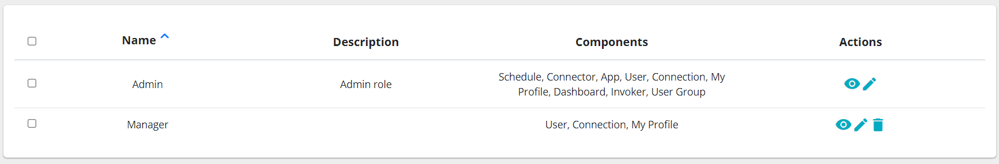
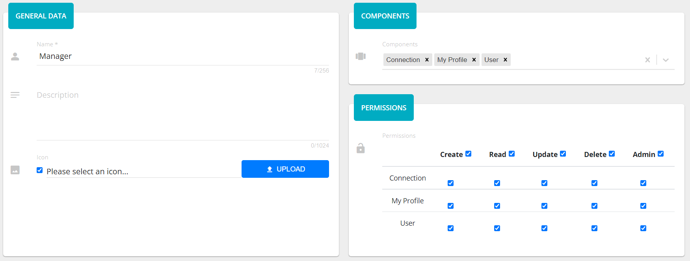
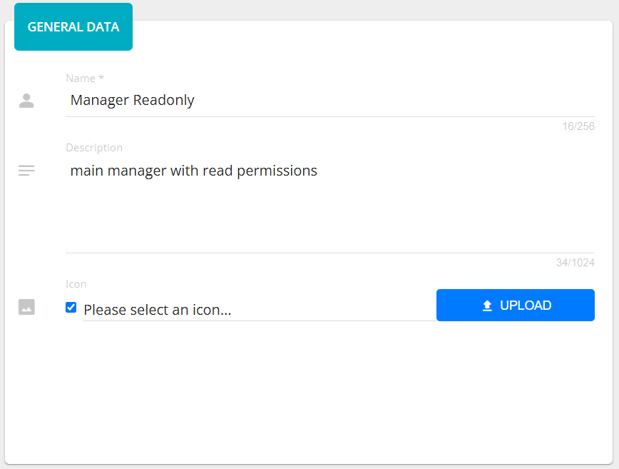
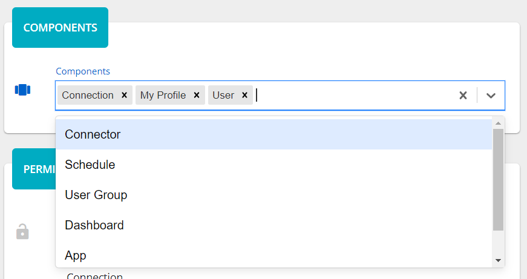
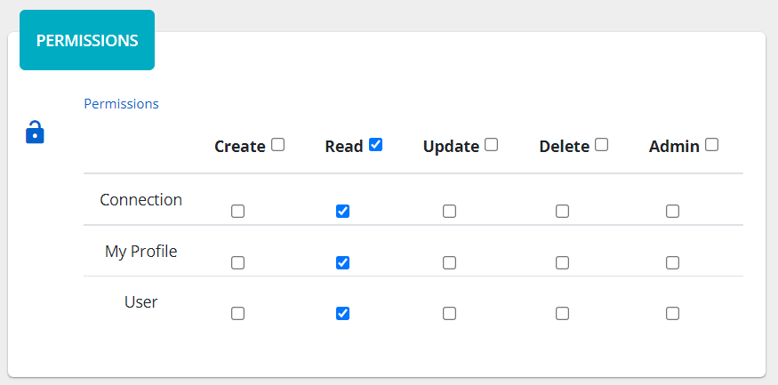

##################
Groups
##################

Group or User Group is a set of users with defined permissions. The grid
view displays names of groups, whereas the list view has more information,
like: description and components.

|image0|

Opening view of the group you will see the description and a table of
permissions to the corresponding component.

|image1|

Adding/Updating group consists of three steps: general data, components
and permissions. General data step has three input fields: *name*,
*description* and *icon*. The *name* is a required field.

|image2|

Components step has one required multiselect field - *components*. There
are 9 components in total: My Profile, User, User Group, Connector,
Connection, Schedule, Dashboard, App, Invoker. You can select several values
clicking on the items and undo clicking on the **x**.

|image3|

The last permissions step has a table of permissions related to
components that were chosen. It is required, so you should check at
least one permission. You check what user can do with a component:
create, read, update, or delete. The admin column just checks all
permissions for the corresponding row.

|image4|

