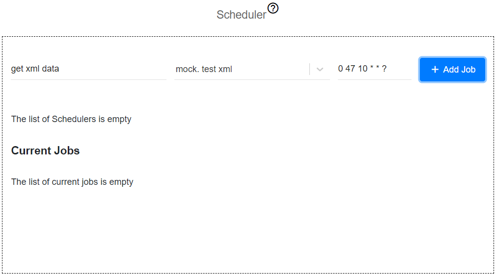
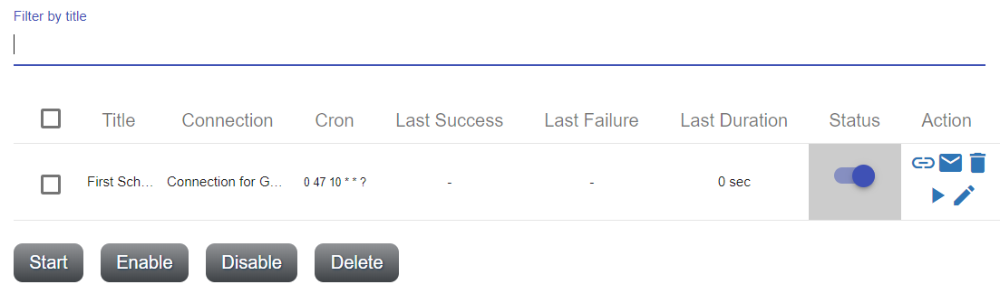
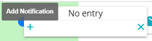
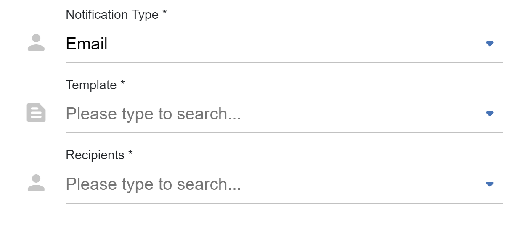
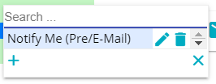
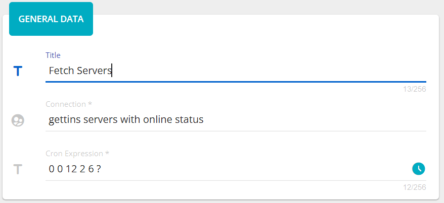
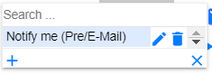

##################
Scheduler
##################

Scheduler defines when and what connection should be performed. All CRUD
actions are on one page. To add a new job for scheduler you need to fill
out 3 required fields: *title, connection* and *cron
expression*. If data will be invalid you will be informed through
notifications after clicking **Add Job**.

|image0|

The list of schedules displays next information: *title, connection, cron*,
time of *last success* trigger, time of *last failed* trigger, *duration* time
and *status*. If background of status grey, it means that job
was not still triggered, if green - last performance was successful and
red, if it was failed. There is also a switcher that gives you an
ability to enable or disable schedule.

|image1|

The background of the whole row becomes grey if you disable schedule.
The *Action* column has five icons: |image2| - *webhook*, |image3| - *notifications*,
|image4|- *delete* job, |image5|- *start* job (immediately), |image6| - *update*.

Clicking on the *webhook* the application creates a webhook for the specific connection.
Due to it the user can trigger this connection using only url. To get
this url, just click on the |image7|. The url is stored in the
buffer. Now you can paste it where you need.

*Notifications* are such functionality that allows you to be notified via emails when
pre, post or alert event happens.

|image8|

After clicking on add, provide *name*, *event*, *notification type*.

|image9|

Choosing type you need to select template of that type and recipients who gets a notification.

|image10|

*Update* schedule gives an opportunity to update the name of the schedule.

|image11|

.. |image6| image:: ../img/schedule/6.png

