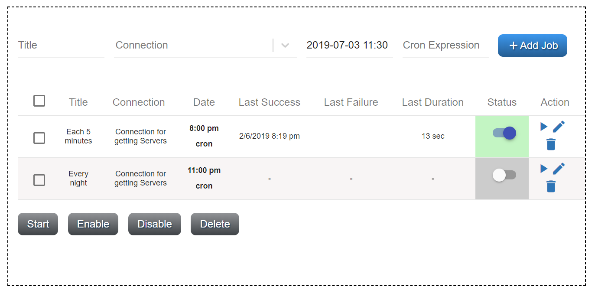
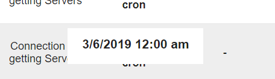
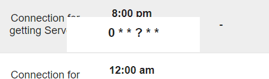

##################
Scheduler
##################

Scheduler defines when and what connection should be performed. All CRUD
actions are on one page. To add a new job for scheduler you need to fill
out 4 required fields: *title, connection, start time* and *cron
expression*. If data will be invalid you will be informed through
notifications after clicking **Add Job**.

|image0|

The list of schedules displays next information: *title, connection,
last date*, time of *last success* trigger, time of *last failed*
trigger, and *status*. If background of status grey, it means that job
was not still triggered, if green - last performance was successful and
red, if it was failed. There is also a switcher that gives you an
ability to enable or disable schedule. The background of the whole row
becomes grey it you disable schedule. The *Action* column has three
icons: |image1|- *start job* (immediately), |image2| - *update* and
|image3|- *delete* job.

|image4|

Clicking on the *time* in the *Date* column, the message will appear
with the whole date information. If you click on the *cron*, you will
see a full cron expression.

|image5| |image6|

.. |image0| image:: ../img/schedule/image5.png
   :width: 6.27083in
   :height: 3.11111in
   :align: middle

