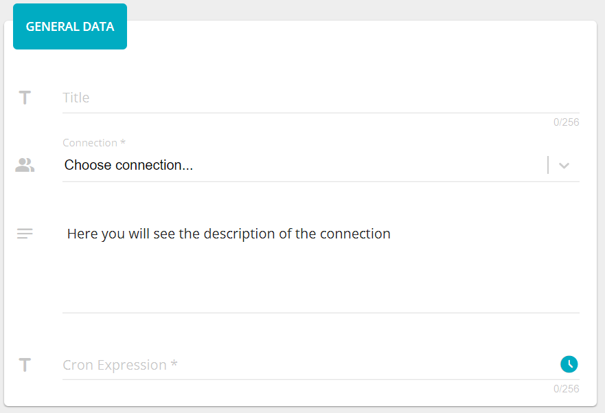
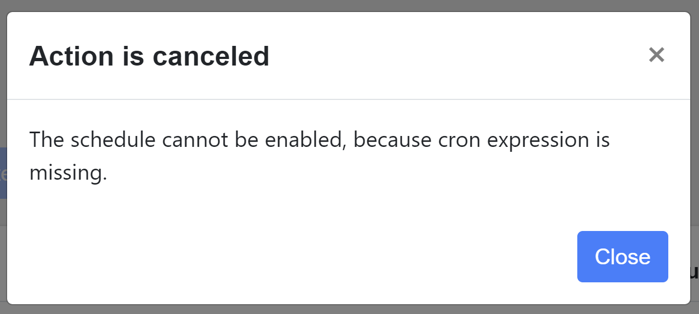
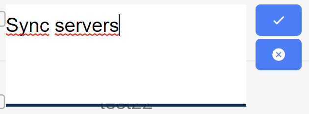
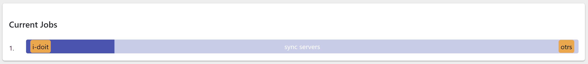
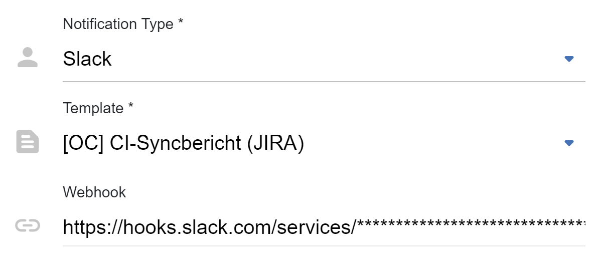
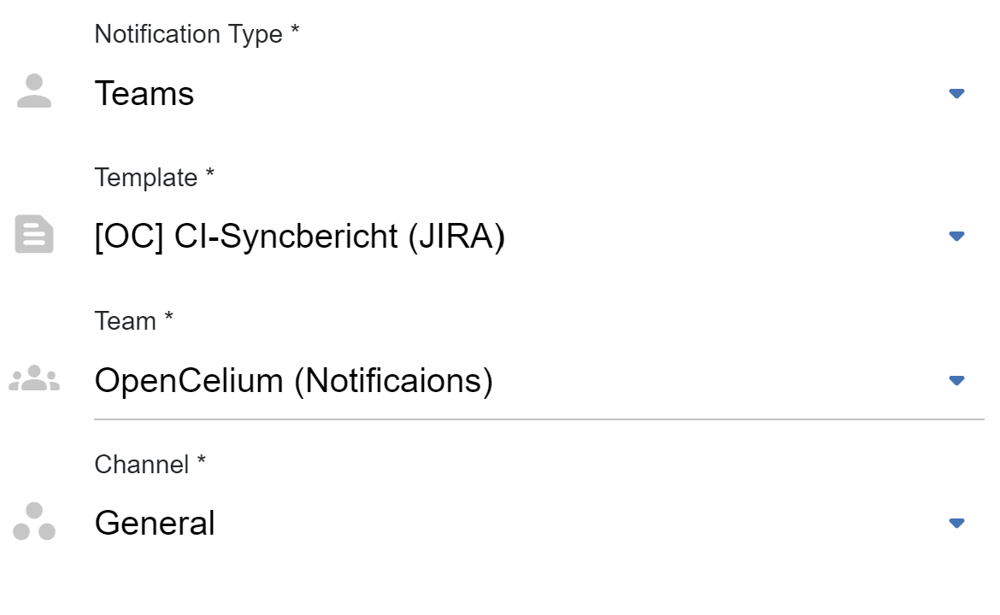
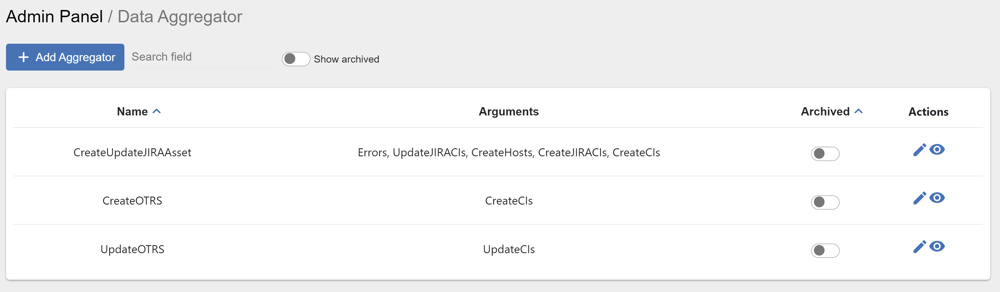
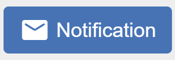

##################
Scheduler
##################

Scheduler defines when and what connection should be performed. All CRUD
actions are on one page. To add a new job for scheduler you need to fill
out 2 required fields: *title*, *connection*; and two optional fields: *logs*
and *cron expression*. As a default logs are deactivated.

|image_1|

The definition of the cron expression can be done easily with the cron generator
|image10|. Here you can choose the exactly or each timestamp when the job should
be triggered. Setting all data, you will see a list of the nearest triggering timestamps.

|image11|

The list of schedules displays next information: *title, connection, cron*,
time of *last success* trigger, time of *last failed* trigger, *duration* time, *status*
and *logs*.

|image0|

The *title* you can change directly inline double clicking on its text.

|image15|

If the background of status is grey, it means that job was not still triggered,
if green - last performance was successful and red, if it was failed.
There is also a switcher that gives you an ability to enable or disable schedule.
If the cron job of the schedule was not set, then you cannot change the status.

|image13|

The *Action* column has five additional icons: |image10| - *edit*, |image3|- *start* job (immediately),
|image1| - *webhook*, |image2| - *notifications*, |image14| - *delete*.

Clicking on the *webhook* the application creates a webhook for the specific connection.
Due to it the user can trigger this connection using only url. To get
this url, just click on the |image4|. The url is stored in the
buffer. Now you can paste it where you need.

*Notification* is such a feature that allows you to be notified via emails, slack or teams when
pre, post or alert event happens.

.. note::
	The aggregator applied only for post events.

You can also apply the same notification for multiple schedules. Just select needed schedules and
press on the notification button |image24|

|image5|

After clicking on add, provide *name*, *event*, *notification type* and after *template*.

|image6|

For E-mail type you need to select the recipients who gets a notification.

|image7|

For Slack type you need to provide the webhook of the channel.

|image18|

For Teams type your need to select the team and its channel.

|image19|

After creating the notification you will see a list of notifications and search to look for them
by name, event or notification type. Also, you can update or delete the corresponding notification,
if you mouse over on one of them and click on the icon.

Current triggering schedules are displayed down after the list. You can follow the process.

|image17|

.. |image0| image:: ../img/schedule/0.png
   :align: middle
.. |image1| image:: ../img/schedule/1.png
   :width: 30
.. |image2| image:: ../img/schedule/2.png
   :width: 30
.. |image3| image:: ../img/schedule/3.png
   :width: 30
.. |image4| image:: ../img/schedule/4.png
   :width: 30
.. |image5| image:: ../img/schedule/5.png
   :align: middle
   :width: 400
.. |image6| image:: ../img/schedule/6.png
   :align: middle
   :width: 400
.. |image7| image:: ../img/schedule/7.png
   :align: middle
.. |image10| image:: ../img/schedule/10.png
   :width: 30
.. |image11| image:: ../img/schedule/11.png
   :width: 30
   :align: middle

