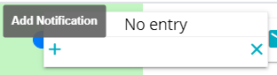
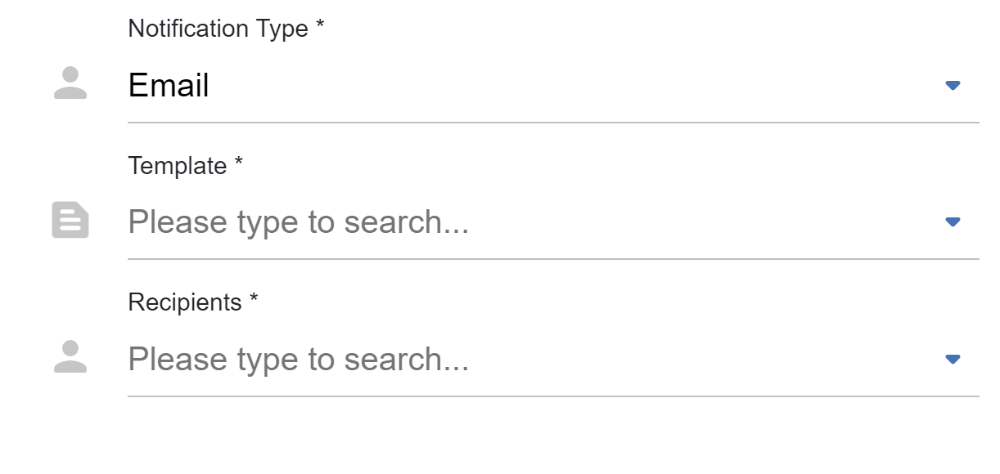
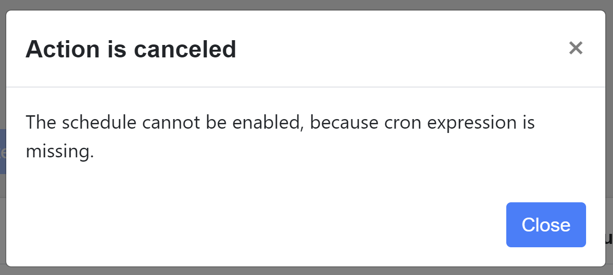
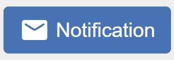

##################
Schedules
##################

The *Schedules* panel shows an overview of all schedules that have been set up. In
general, a schedule defines which connection should be performed when. All CRUD 
actions are one one page. The list view shows the following information for each
connection:

   * **Status**
      * **grey**: connections without Cron-job
      * **green**: last run was successful
      * **red**: last run was unsuccessful
   * Name of the **connection**
   * **Cron** expression
   * Date and time of the last **successful run** of the connection
   * Date and time of the last **unsuccessful run** of the connection
   * **Duration** of the last successful run
   * Switch for activating/deactivating the **logs**
   * **Webhook**

Above the list you can see the categories. These are categories defined
on the :ref:`connection page <usage-connection>`. You cannot modify them
here. All displayed schedules can be filtered by the corresponded connection category.

|image_schedules_1|

The logs could be enabled/disabled directly here clicking on the toggle button.

|image13|

If the schedule contains webhook, it could be copied clicking on the icon: |image4|.
The url is stored in the clipboard. Now you can paste it where you need.

The *Action* column has six additional icons:

|image_schedules_10| - *edit*

|image_schedules_11|- *start* job (immediately)

|image_schedules_12| - *webhook*

|image_schedules_13| - *notifications*

|image_schedules_14| - *logs*

|image_schedules_15| - *delete*

Below the list view, the progress of a connection is displayed if it has been started
manually or automatically by a trigger. A running connection can be canceled by clicking
on the "**x**" on the right side.

|image_schedules_2|

To add a new job for the scheduler click on the button "Add Schedule". 

|image_schedules_3|

An empty mask opens where you have to enter the following information:

   * **title** (mandatory)
   * **connection** (mandatory)
   * **logs** (optional, disabled by default)
   * **cron expression** (optional)

|image_schedules_4|

The *title* is displayed in the list of the Schedules panel. It should be descriptive to
make it easy to identify the correct schedule.

Activate the *logs* if required; they are deactivated by default to avoid unnecessary
logging. The logging function can also be activated later if required.

Use the search function or the drop down list to select one existing *connection*. The
description of the connections is displayed as well to make the identification of the
correct connection more easy.

|image_schedules_5|

The definition of the cron expression can be done easily with the cron generator
|image_schedules_10|. Here you can choose the exactly or each timestamp when the job should
be triggered. Setting all data, you will see a list of the nearest triggering timestamps.

|image_schedules_6|

As soon as all required settings have been made click on the button "Add" sto save the
schedule.

|image_schedules_7|

Webhook
"""""""""""""""""
A *webhook* allows a connection to be triggered using a URL that is called up. A
webhook can be created for each schedule by clicking on the corresponding action for creating
a webhook |image_schedules_12|.

If a webhook has been created for a schedule, this can be seen from the corresponding
icon |image_schedules_17| in the column *Webhook*.

Clicking on the icon |image_schedules_17| copies the URL of the webhook to the clipboard so that it can be
inserted at the desired location.

Clicking on the icon |image_schedules_16| disables the webhook for the respective schedule again.

Notifications
"""""""""""""""""

*Notification* is such a feature that allows you to be notified via emails or webhooks when
pre, post or alert event happens.

.. note::
	The aggregator applied only for post events.

You can also apply the same notification for multiple schedules. Just select needed schedules and
press on the notification button |image24|

|image5|

Before you create a notification, you need to create a template that is described  :ref:`here <management-notification_template>`.
After clicking on add, provide *name*, *event*, *notification type* and after *template*.

|image6|

For E-mail type you need to select the recipients who gets a notification.

|image7|

For webhook type you need to provide the webhook of the target system.

After creating the notification you will see a list of notifications and search to look for them
by name, event or notification type. Also, you can update or delete the corresponding notification,
if you mouse over on one of them and click on the icon.

Current triggering schedules are displayed down after the list. You can follow the process.

|image17|

If you click on the *x* icon, you will interrupt the current job.

.. |image_schedules_1| image:: ../img/schedule/OC_schedules_list.png
   :align: middle
   :width: 600
.. |image_schedules_2| image:: ../img/schedule/OC_schedules_current_job.png
   :align: middle
   :width: 600
.. |image_schedules_3| image:: ../img/schedule/OC_schedules_button_add_schedule.png
   :align: middle
   :height: 30
.. |image_schedules_4| image:: ../img/schedule/OC_schedules_add_general_data.png
   :align: middle
   :width: 400
.. |image_schedules_5| image:: ../img/schedule/OC_schedules_add_connection.png
   :align: middle
   :width: 400
.. |image_schedules_6| image:: ../img/schedule/OC_schedules_cron_generator.png
   :align: middle
   :width: 400
.. |image_schedules_7| image:: ../img/schedule/OC_schedules_button_add.png
   :align: middle
   :height: 30

.. |image_schedules_10| image:: ../img/schedule/OC_schedules_icon_edit.png
   :height: 21
.. |image_schedules_11| image:: ../img/schedule/OC_schedules_icon_play.png
   :height: 21
.. |image_schedules_12| image:: ../img/schedule/OC_schedules_icon_webhook.png
   :height: 21
.. |image_schedules_13| image:: ../img/schedule/OC_schedules_icon_notification.png
   :height: 21
.. |image_schedules_14| image:: ../img/schedule/OC_schedules_icon_logs.png
   :height: 21
.. |image_schedules_15| image:: ../img/schedule/OC_schedules_icon_trash.png
   :height: 21
.. |image_schedules_16| image:: ../img/schedule/OC_schedules_icon_disable_webhook.png
   :height: 21
.. |image_schedules_17| image:: ../img/schedule/OC_schedules_icon_copy_webhook.png
   :height: 21
      
.. |image1| image:: ../img/schedule/1.png
   :width: 30
.. |image2| image:: ../img/schedule/2.png
   :width: 30
.. |image3| image:: ../img/schedule/3.png
   :width: 30
.. |image4| image:: ../img/schedule/4.png
   :width: 30

.. |image10| image:: ../img/schedule/10.png
   :width: 30

.. |image14| image:: ../img/schedule/14.png
   :width: 30
.. |image17| image:: ../img/schedule/17.png
   :align: middle
.. |image20| image:: ../img/schedule/20.png

