##################
Schedules
##################

The *Schedules* panel shows an overview of all schedules that have been set up. In
general, a schedule defines which connection should be performed when. All CRUD 
actions are one one page. The list view shows the following information for each
connection:

   * **Status**
      * **grey**: connections without Cron-job
      * **green**: last run was successful
      * **red**: last run was unsuccessful
   * Name of the **connection**
   * **Cron** expression
   * Date and time of the last **successful run** of the connection
   * Date and time of the last **unsuccessful run** of the connection
   * **Duration** of the last successful run
   * Switch for activating/deactivating the **logs**
   * **Webhook**

Above the list you can see the categories. These are categories defined
on the :ref:`connection page <usage-connection>`. You cannot modify them
here. All displayed schedules can be filtered by the corresponded connection category.

|image_schedules_1|

The logs could be enabled/disabled directly here clicking on the toggle button.

If the schedule contains webhook, it could be copied clicking on the icon: |image4|.
The url is stored in the clipboard. Now you can paste it where you need.

The *Action* column has six additional icons:

|image_schedules_10| - *edit*

|image_schedules_11|- *start* job (immediately)

|image_schedules_12| - *webhook*

|image_schedules_13| - *notifications*

|image_schedules_14| - *logs*

|image_schedules_15| - *delete*

Below the list view, the progress of a connection is displayed if it has been started
manually or automatically by a trigger. A running connection can be canceled by clicking
on the "**x**" on the right side.

|image_schedules_2|

|image17|

Adding a new schedule
"""""""""""""""""

To add a new job for the scheduler click on the button "Add Schedule". 

|image_schedules_3|

An empty mask opens where you have to enter the following information:

   * **title** (mandatory)
   * **connection** (mandatory)
   * **logs** (optional, disabled by default)
   * **cron expression** (optional)

|image_schedules_4|

The *title* is displayed in the list of the Schedules panel. It should be descriptive to
make it easy to identify the correct schedule.

Activate the *logs* if required; they are deactivated by default to avoid unnecessary
logging. The logging function can also be activated later if required.

Use the search function or the drop down list to select one existing *connection*. The
description of the connections is displayed as well to make the identification of the
correct connection more easy.

|image_schedules_5|

The definition of the cron expression can be done easily with the cron generator
|image_schedules_10|. Here you can choose the exactly or each timestamp when the job should
be triggered. Setting all data, you will see a list of the nearest triggering timestamps.

|image_schedules_6|

As soon as all required settings have been made click on the button "Add" sto save the
schedule.

|image_schedules_7|

Cron Generator
"""""""""""""""""
The Cron Generator supports you in creating the most common cron expressions for triggering
the schedules. To create a cron expression, select the desired values from the selection
lists. Below the selection lists, you will see a preview of when the job would run with
the current settings.

|image_crongenerator_1|

Once you have made the desired settings, confirm the settings by
clicking on the “**OK**” button.

|image_crongenerator_2|

The finished expression is now displayed in the "*Cron Expression*" field. Alternatively,
you can also enter an expression directly in the “*Cron Expression*” field.

|image_crongenerator_3|

A cron expression is a string comprised of 6 or 7 fields separated by white space. The
first 6 fields are mandatory, the last field is optional. The following fields are used
in a cron expression:

   * Second
   * Minute
   * Hour
   * Day of the month
   * Month
   * Day of the week
   * Year (optional)

Save the schedule by clicking on the “**Add**” or “**Update**” button.

|image_crongenerator_4| or |image_crongenerator_5|

OpenCelium uses the Quartz Job Scheduling Library for the cron jobs.

On the Quartz page you will find `examples`_ for the correct creation of cron expressions,
which can be used in OpenCelium.

.. _examples: https://www.quartz-scheduler.org/documentation/quartz-2.2.2/tutorials/crontrigger.html

**Examples:**

.. code-block::

   0 0 12 * * ?

**Meaning:** Run at 12pm (noon) every day

.. code-block::

   0 * 14 * * ? 

**Meaning:** Run at 10:15am every day

.. code-block::

   0 0/5 14,18 * * ? 

**Meaning:** Run every 5 minutes starting at 2pm and ending at 2:55pm, AND fire every 5 minutes starting
at 6pm and ending at 6:55pm, every day

Webhook
"""""""""""""""""
A *webhook* allows a connection to be triggered using a URL that is called up. A
webhook can be created for each schedule by clicking on the corresponding action for creating
a webhook |image_schedules_12|.

If a webhook has been created for a schedule, this can be seen from the corresponding
icon |image_schedules_17| in the column *Webhook*.

Clicking on the icon |image_schedules_17| copies the URL of the webhook to the clipboard so that it can be
inserted at the desired location.

Clicking on the icon |image_schedules_16| disables the webhook for the respective schedule again.

Notifications
"""""""""""""""""

The *notifications* are a feature that allows you to be informed about certain events via e-mail
or webhook. The available events are pre, post and altert.

   * **pre** - notification is triggered **before** the schedule
   * **post** - notification is triggered **after** the schedule
   * **altert** - notification is triggered in the **event of an error**.

.. note::
   The aggregator only applies for post events.

You can assign a notification to several schedules. To do this, select the desired schedules in the
list by clicking on the checkboxes and click on the “**Notification**” button |image_notifications_4|.

|image_notifications_1|

If you only want to assign a notification to one schedule, you can alternatively click on the letter
symbol |image_notifications_7| and then on the plus sign to create a new notification.

|image_notifications_2|

.. note::
   Before you create a notification, you need to create a template that is described :ref:`here <management-notification_template>`.

After clicking on "**Add**", provide *name*, *event*, *notification type* and *after template*.

|image_notifications_3|

Select the desired notification type (E-Mail or webhook). For E-mail type you need to select the 
recipients who gets a notification. For webhook type you need to provide the webhook of the target system.

|image_notifications_5|

After creating the notification you will see a list of notifications and a search where you can search
for a notification by name, event or notification type. You can *update* or *delete* the corresponding notification,
if you mouse over on one of them and click on the respective icon.

|image_notifications_6|

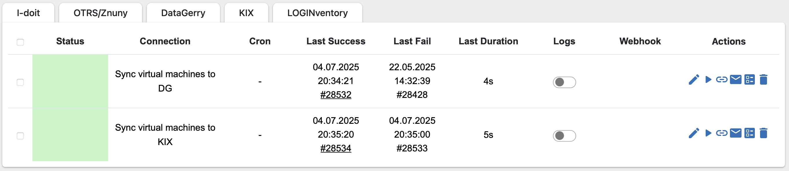
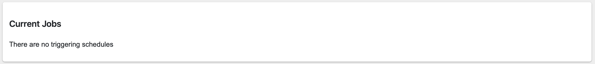
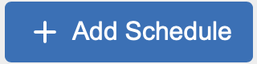
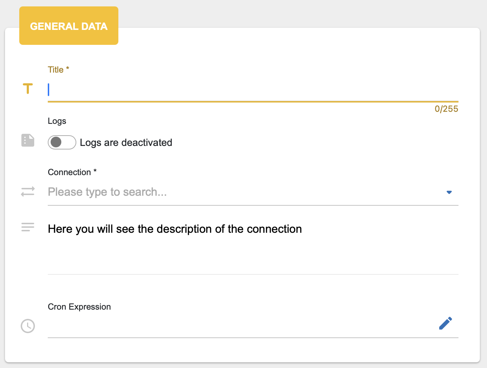
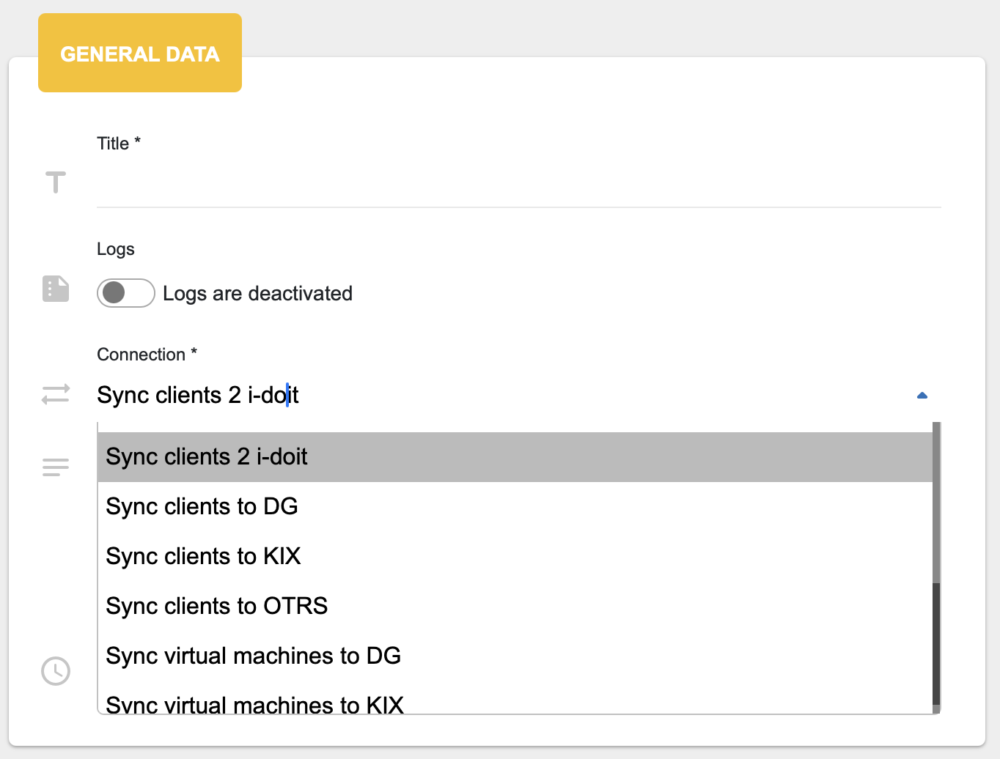
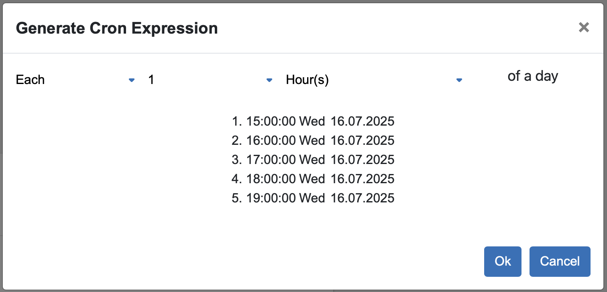

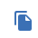

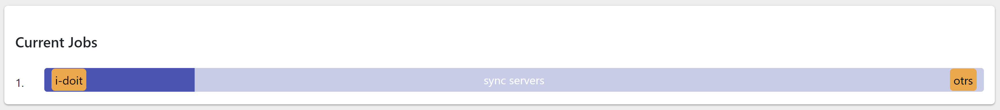

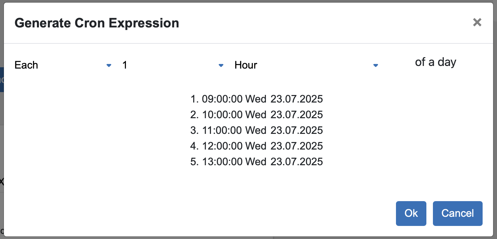

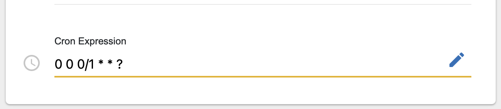

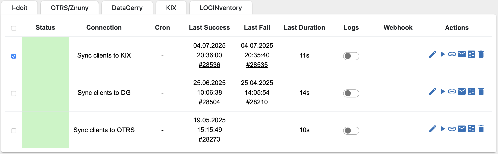
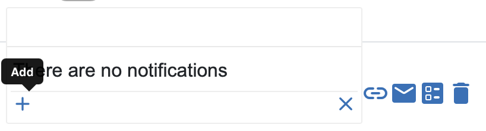
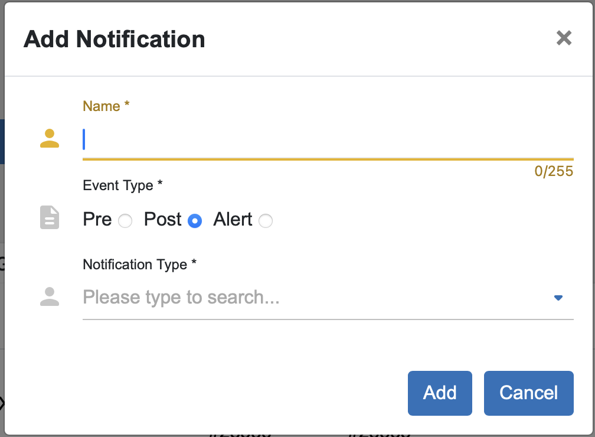

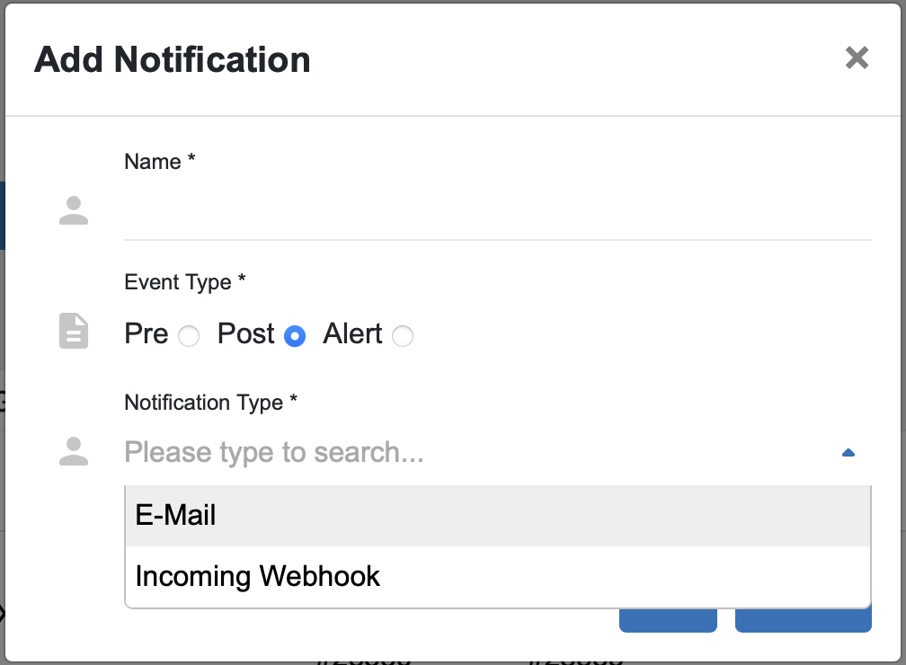
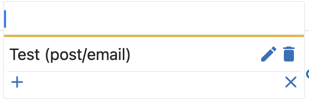

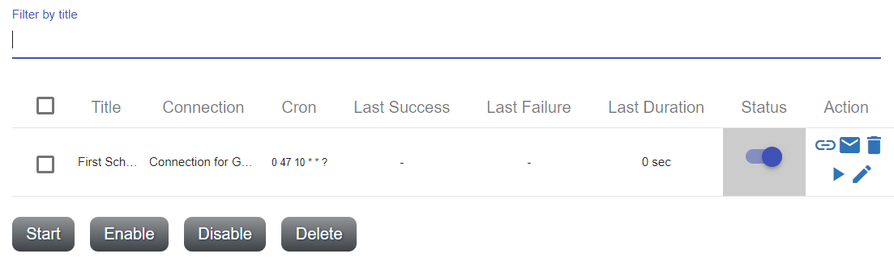

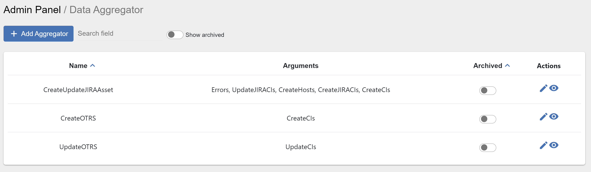
