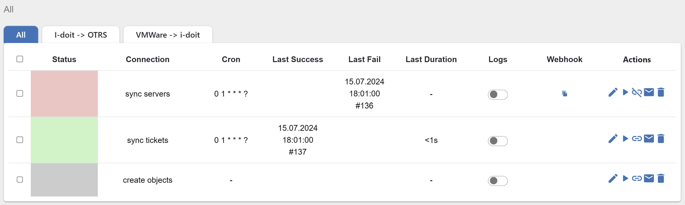
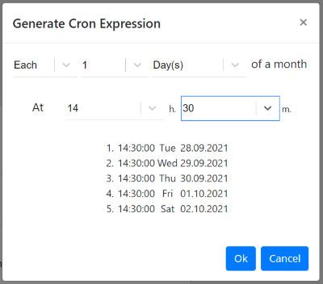
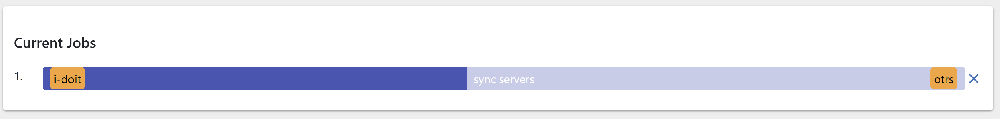

##################
Scheduler
##################

Scheduler defines when and what connection should be performed. All CRUD
actions are on one page. To add a new job for scheduler you need to fill
out 2 required fields: *title*, *connection*; and two optional fields: *logs*
and *cron expression*. As a default logs are deactivated.

|image_1|

The definition of the cron expression can be done easily with the cron generator
|image10|. Here you can choose the exactly or each timestamp when the job should
be triggered. Setting all data, you will see a list of the nearest triggering timestamps.

|image11|

The list of schedules displays next information: *status, connection title, cron*,
time of *last success* trigger, time of *last failed* trigger, *duration* time, *logs*
and *webhook*. Above the list you can see the categories. These are categories defined
on the `connection page
<https://docs.opencelium.io/en/prod/usage/connections.html>`_. You cannot modify them
here. All displayed schedules are filtered by the corresponded connection category.

|image0|

If the background of status is grey, it means that job does not have cron expression,
if green - last performance was successful and red, if it was failed.

|image13|

The logs could be enabled/disabled directly here clicking on the switcher.

If the schedule contains webhook, it could be copied clicking on the icon: |image4|.
The url is stored in the buffer. Now you can paste it where you need.

The *Action* column has five additional icons:

|image10| - *edit*

|image3|- *start* job (immediately)

|image1| - *webhook*

|image2| - *notifications*

|image14| - *delete*

Clicking on the *webhook* the application creates a webhook for the specific connection.
Due to it the user can trigger this connection using only url.

Notification
"""""""""""""""""

*Notification* is such a feature that allows you to be notified via emails or webhooks when
pre, post or alert event happens.

.. note::
	The aggregator applied only for post events.

You can also apply the same notification for multiple schedules. Just select needed schedules and
press on the notification button |image24|

|image5|

Before you create a notification, you need to create a template that is described `here
<https://docs.opencelium.io/en/prod/management/notification_template.html>`_.
After clicking on add, provide *name*, *event*, *notification type* and after *template*.

|image6|

For E-mail type you need to select the recipients who gets a notification.

|image7|

For webhook type you need to provide the webhook of the target system.

After creating the notification you will see a list of notifications and search to look for them
by name, event or notification type. Also, you can update or delete the corresponding notification,
if you mouse over on one of them and click on the icon.

Current triggering schedules are displayed down after the list. You can follow the process.

|image17|

If you click on the *x* icon, you will interrupt the current job.

.. |image_1| image:: ../img/schedule/-1.png
   :align: middle

.. |image2| image:: ../img/schedule/2.png
   :width: 30

.. |image4| image:: ../img/schedule/4.png
   :width: 30
.. |image5| image:: ../img/schedule/5.png
   :align: middle
   :width: 400
.. |image6| image:: ../img/schedule/6.png
   :align: middle
   :width: 400
.. |image7| image:: ../img/schedule/7.png
   :align: middle
   :width: 400
.. |image10| image:: ../img/schedule/10.png
   :width: 30

