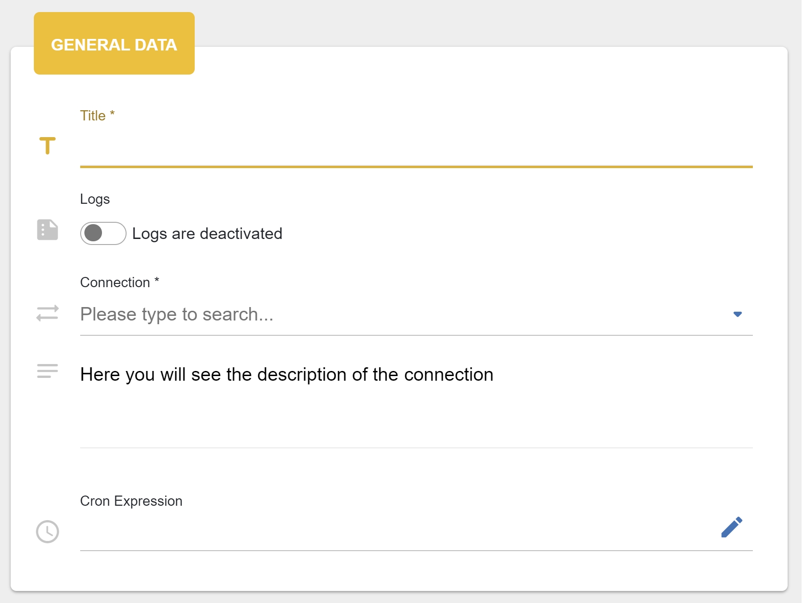
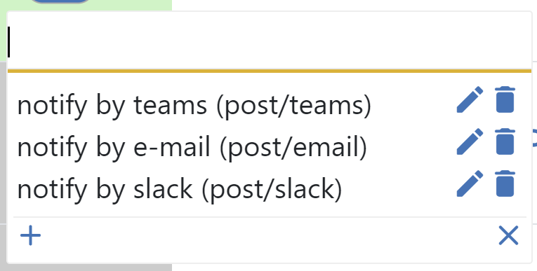
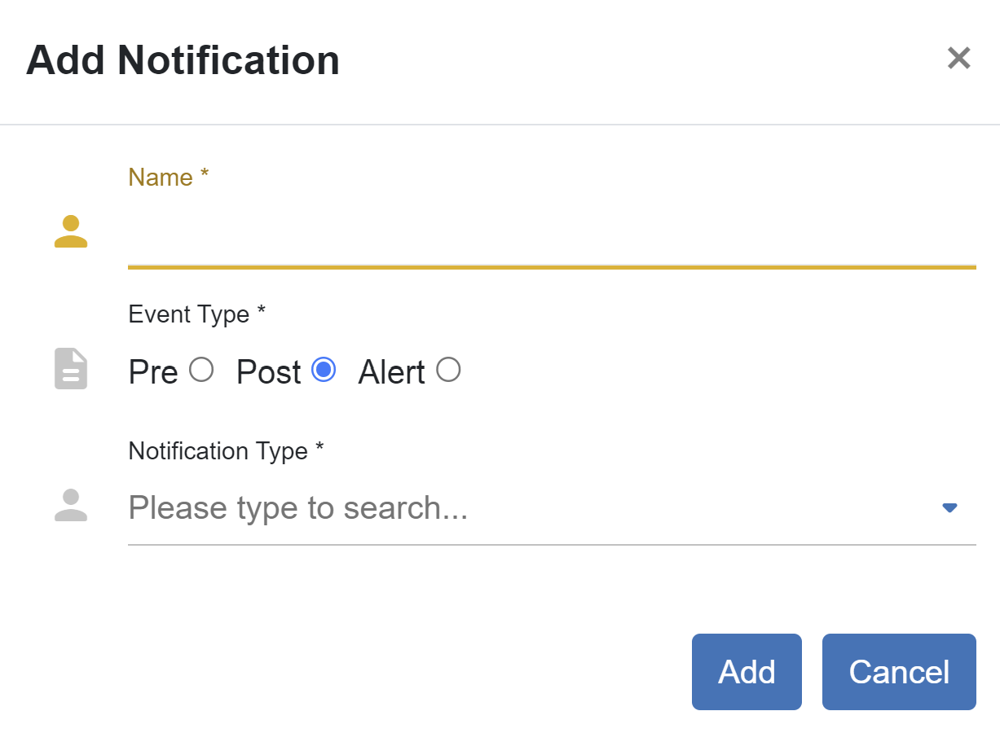

##################
Scheduler
##################

Scheduler defines when and what connection should be performed. All CRUD
actions are on one page. To add a new job for scheduler you need to fill
out 3 required fields: *title, connection* and *cron
expression*.

|image_1|

The defining of the cron expression can be done easily with the cron generator
|image10|. Here you can choose the exactly or each timestamp when the job should
be triggered. Setting all data, you will see a list of the nearest triggering timestamps.

|image11|

The list of schedules displays next information: *title, connection, cron*,
time of *last success* trigger, time of *last failed* trigger, *duration* time
and *status*. If background of status grey, it means that job
was not still triggered, if green - last performance was successful and
red, if it was failed. There is also a switcher that gives you an
ability to enable or disable schedule. The background of the whole row becomes
grey if you disable schedule. The *Action* column has three additional icons:
|image1| - *webhook*, |image2| - *notifications*, |image3|- *start* job (immediately).

|image0|

Clicking on the *webhook* the application creates a webhook for the specific connection.
Due to it the user can trigger this connection using only url. To get
this url, just click on the |image4|. The url is stored in the
buffer. Now you can paste it where you need.

*Notifications* are such functionality that allows you to be notified via emails when
pre, post or alert event happens.

|image5|

After clicking on add, provide *name*, *event*, *notification type*.

|image6|

Choosing type you need to select template of that type and recipients who gets a notification.

|image7|

After creating the notification you will see a list of notifications and search to look for them
by name, event or notification type. Also, you can update or delete the corresponding notification,
if you mouse over on one of them and click on the icon.

|image8|

*Update* schedule gives an opportunity to update the name of the schedule.

|image9|

There are three additional multiple actions for the selected schedules: *start* - trigger schedules,
*enable* and *disable* which are on and off the jobs.

|image12|

.. |image0| image:: ../img/schedule/0.png
   :align: middle
.. |image1| image:: ../img/schedule/1.png
.. |image2| image:: ../img/schedule/2.png
.. |image3| image:: ../img/schedule/3.png

.. |image7| image:: ../img/schedule/7.png
   :align: middle
.. |image8| image:: ../img/schedule/8.png
   :align: middle
.. |image9| image:: ../img/schedule/9.png
   :align: middle
.. |image10| image:: ../img/schedule/10.png
.. |image11| image:: ../img/schedule/11.png
   :align: middle
.. |image12| image:: ../img/schedule/12.png
   :align: middle
