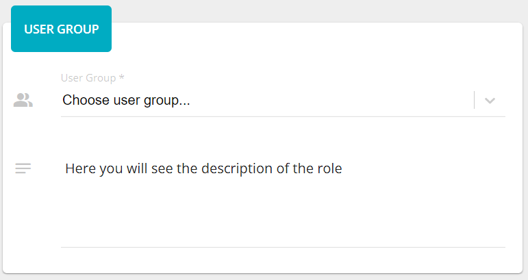
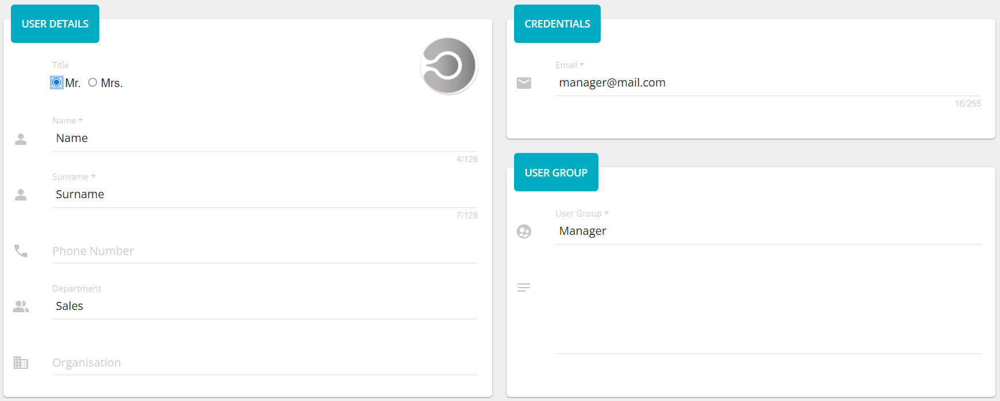
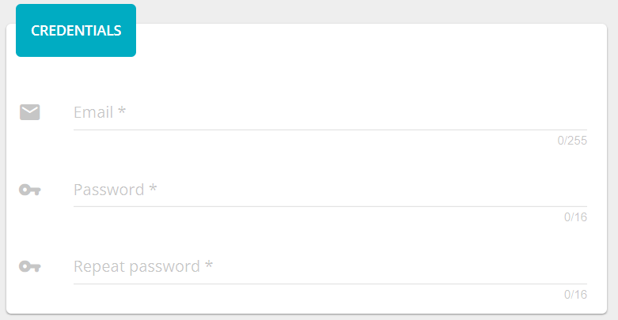
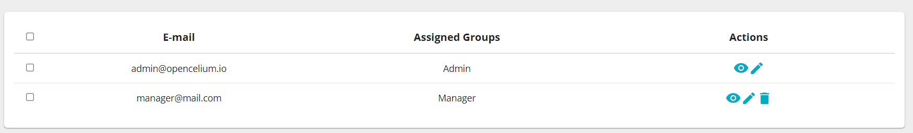

##################
Users
##################

Users represents directly clients of the application. List of users
shows all user of the system including the authorized user, it has a
label - *Current user.* Each element of the list display a first and a
second name of the user and his email.

|image0|

Going into view of the user you see more details: phone number,
department, organization, salutation, avatar, last time of the login and
the group information to which the user belongs. If the user did not
upload his avatar you will see the default image.

|image1|

Adding/Updating user consists of three steps: credentials, user details
and user group. Credential step has three input fields: *email*,
*password* and *repeat password*.

|image2|

The are all required fields. The *email* must be valid and the length
not more than 255 characters. Moreover, it is also a unique field in the
application.

|image3|

The *password*\ ’s and *repeat password*\ ’s fields length must be
between 8 and 16 symbols. The last one should have the same value as the
*password* field.

|image4|

User Details step has next fields: *name, surname, phone number,
organization, department, salutation, avatar.*

|image5|

*Name* and *surname* are required fields.

|image6|

User Group step has only one select field - *user group* and a textarea
with a description to selected item. Meaning of the user group you can
find the the chapter *Groups*.

|image7|

.. |image0| image:: ../img/user/image7.png
   :width: 6.27083in
   :height: 3.80556in
   :align: middle

.. |image4| image:: ../img/user/image4.png
   :width: 6.27083in
   :height: 3.11111in
   :align: middle

.. |image6| image:: ../img/user/image8.png
   :width: 6.27083in
   :height: 5.05556in
   :align: middle

