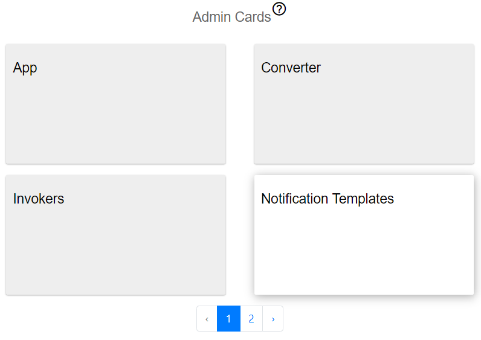
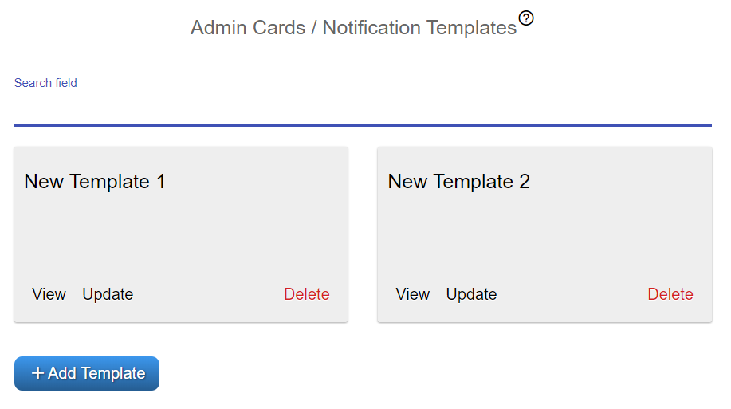
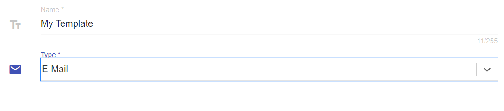
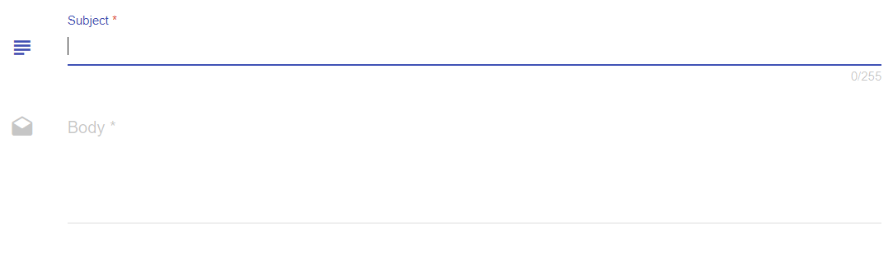

##################
Manage Notification Templates
##################

Notification Templates can be managed from UI. Let us consider the next use case.

**You, as a user, want to manage templates for notifications in the OpenCelium.**

First of all you need to click on *Admin* menu. There is a *Notification Templates* item.

|image0|

Navigate to it and you will see the list of templates with a search input (if the list is not empty).

|image1|

Here you can as usually add, update or delete the template. When you add or update it, you go throw two steps.
First step is to provide *name* and *type*.

|image2|

On the second step you enter *subject* and *body* of the template.

|image3|

.. note::
	You can use next references inside the body: USER_NAME, USER_SURNAME, USER_TITLE, USER_DEPARTMENT, CONNECTION_ID, CONNECTION_NAME,, SCHEDULER_ID, SCHEDULER_TITLE.
    Just embrace it in curly brackets, for example: {CONNECTION_ID}

