##################
Manage Business Templates
##################

Business Templates can be managed both from UI and from server directly. Let us consider the next use case.

**You, as a user, want to have a template in the OpenCelium.**

That can happen in several ways: Add Template or Import Template. To add a template you go firstly in *Add Connection* form. On the third step of adding you can find *Add Template* button.

|image0|

Provide a name, a short description and click on the *Add*.

|image1|

To import an existing template from UI go to the *Admin* page and click on the *Templates* card.

|image2|

There you will see an *+ Import* button.

|image3|

Click on it and upload your template (*json* format). Clicking on *OK* your template will be imported.

|image4|

There is also an opportunity to import a template via server. Go to the root folder and find there *src/main/resources/templates* folder.

|image5|

Copy your template and paste it in this folder. The templated will be catched by the system automatically.

**You, as a user, want to download the template from OpenCelium.**

Go to the *Admin* page and click on the *Templates* card. Here you see all existing templates. Each template has its correspondence *Download* icon. Click on it to get the template in *json* format.

|image6|

**You, as a user, want to use the template in OpenCelium.**

The template itself we need during the adding of connection. Go to *Connection* page and press on *+ Add* button. Provide required information and go further clicking on the arrow. Now you should see two choises of mode: "Expert" and "Template".

|image7|

Clicking on the "Template" the system loads all existing templates to the corresponded connectors.

|image8|

Selecting one of it you will see its short description.

|image9|

Click on the arrow again to use the template.

**You, as a user, want to upgrade the template in OpenCelium.**

Starting from OpenCelium 1.3 version, there is a changed structure inside on the template. It means, to use the older templates in a new version, you need to upgrade them. There are two ways to perform that.
First, you can go to the *Templates* page using *Admin*, as it is described above. There you can upgrade one specific template clicking on the icon

|image12|

or pressing on the Convert All button to convert all
templates to the latest version.

|image13|

Second option is to convert the template directly when you use it in *Connections*. If the template has older version it will be disabled and with conversion icon.

|image14|

Clicking on it, you will convert the template.

**You, as a user, want to change the template in OpenCelium.**

There is no way to change the template via UI for now, but you can change it directly on the server in *src/main/resources/templates* folder in *json* file. But strongly recommended to not do it! Slightly wrong changes in the file (json syntax, logic error) or saving with the incorrect encoding brings you to the error on the *Add Connection* page. We recommend you to create a new template as it is described above.

**You, as a user, want to delete the template from OpenCelium.**

The template can be for sure deleted. You can find the deletion in two places: *Admin/Templates* or *Connections/Add*. The first place shows you a list of all templates and a corresponded *Delete* functionality for each template.

|image10|

The second deletion is on the second step of adding connection, when you choose the *Template Mode*.

|image11|

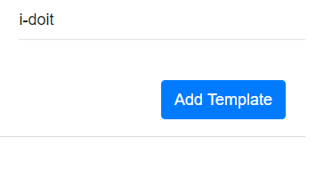
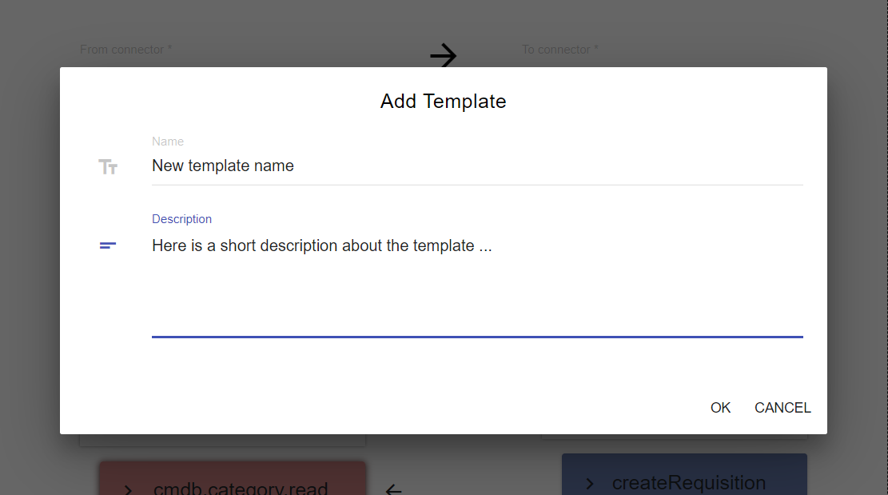
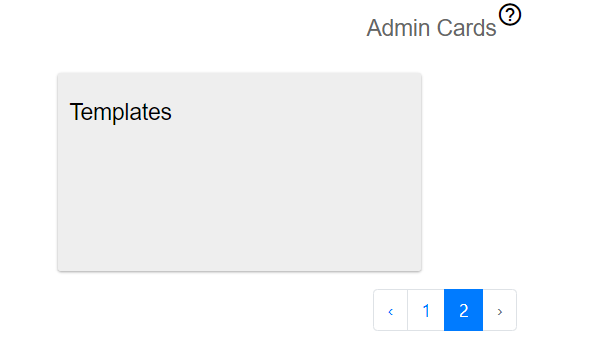
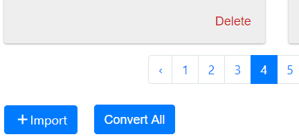
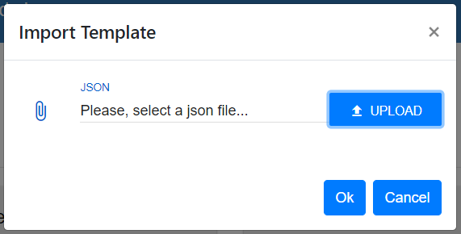
.. |image5| image:: ../img/usecases/manage_templates/backend_0.png
   :align: middle
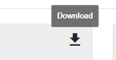
.. |image7| image:: ../img/usecases/manage_templates/use_0.png
   :align: middle
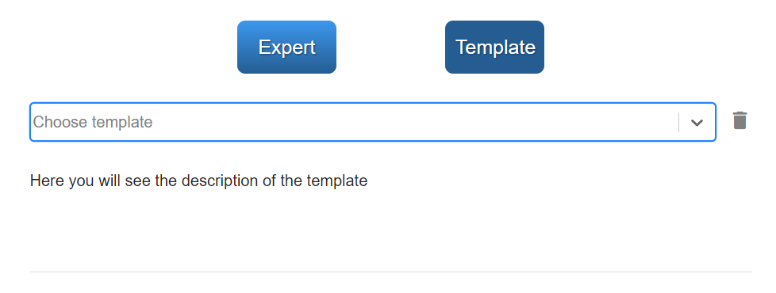
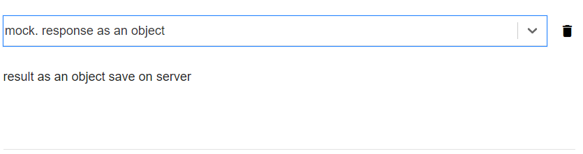
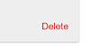
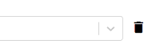
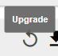

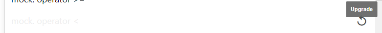
