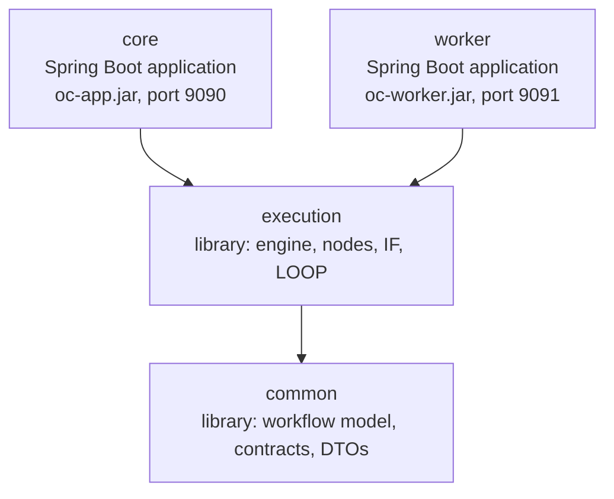
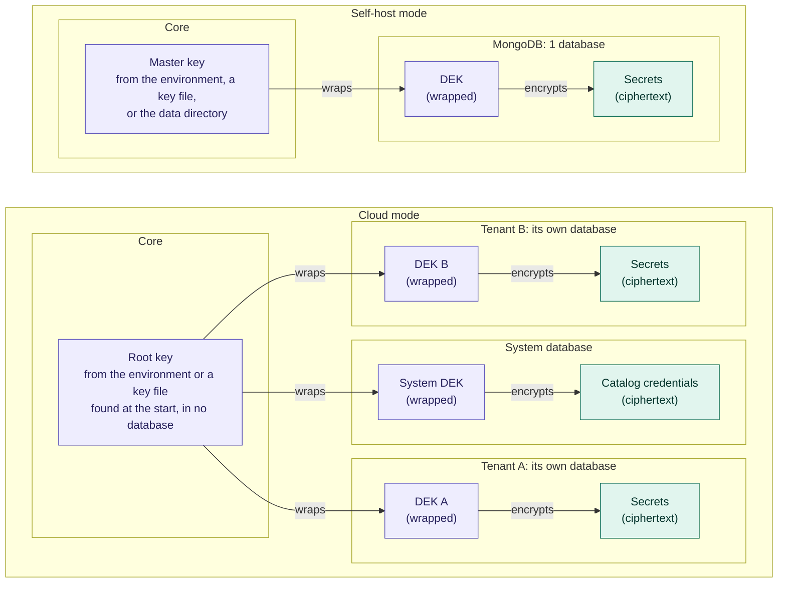

# Backend architecture

This document tells how the OpenCelium backend is made and why. It gives the target design. It does not tell the state of the code. The contribution rules that come from this structure are in [CONTRIBUTING.md](../CONTRIBUTING.md).

## Contents

- [1. Introduction](#1-introduction)
- [2. Solution strategy](#2-solution-strategy)
- [3. Building block view](#3-building-block-view)
  - [3.1 Level 1: the 4 modules](#31-level-1-the-4-modules)
  - [3.2 Level 2: common](#32-level-2-common)
  - [3.3 Level 2: execution](#33-level-2-execution)
  - [3.4 Level 2: core](#34-level-2-core)
  - [3.5 Level 2: worker](#35-level-2-worker)
- [4. Runtime view](#4-runtime-view)
  - [4.1 Core starts](#41-core-starts)
- [5. Deployment view](#5-deployment-view)
  - [5.1 The deployment shapes](#51-the-deployment-shapes)
  - [5.2 Deployment modes](#52-deployment-modes)
  - [5.3 Transport detection rules](#53-transport-detection-rules)
- [6. Cross-cutting concepts](#6-cross-cutting-concepts)
  - [6.1 Domain model](#61-domain-model)
  - [6.2 Transport SPI and events](#62-transport-spi-and-events)
  - [6.3 Tenancy](#63-tenancy)
  - [6.4 Configuration placement](#64-configuration-placement)
  - [6.5 Secrets and keys](#65-secrets-and-keys)
  - [6.6 Persistence](#66-persistence)
  - [6.7 Authentication and authorization](#67-authentication-and-authorization)
  - [6.8 Test concept](#68-test-concept)
  - [6.9 Build checks](#69-build-checks)
- [7. Architecture decisions](#7-architecture-decisions)
  - [Open decisions](#open-decisions)
- [8. Glossary](#8-glossary)

## 1. Introduction

OpenCelium is a platform for API integration and workflow automation, similar to n8n. Users add **invokers**, configure **connectors**, and make **workflows**. A workflow gets data from one API, changes the data, and sends the data to another API. A workflow has 2 flow operators: **IF** for decisions and **LOOP** to do the same steps for each item of a collection. The terms are in the [glossary](#8-glossary).

## 2. Solution strategy

The platform has 2 different workloads:

1. **Management.** Users make connectors, design workflows, and schedule them. This workload is interactive and has a low volume.
2. **Execution.** Workflows execute: they call APIs, evaluate IF nodes, and go through LOOP nodes. This workload is like a batch job and grows with the data volume.

The architecture keeps these 2 workloads apart. All other structure comes from this separation. The strategy in short, with the decision that records each line:

- A modular monolith. The compiler enforces the module boundaries (decision 1).
- One build and 2 deployment shapes. Core finds the shape at runtime (decisions 2, 4).
- The engine is a library. The applications are thin hosts (decision 3).
- Promise-based dataflow execution, with checkpoints (decisions 8, 12).
- Workers without state. Each job message is self-contained (decision 9).
- The tenant context is in each document, each job message, and each event (decision 11).
- Configuration in 2 places, and envelope encryption for the secrets (decisions 13, 14).
- Authentication is a plug-in, separate from authorization (decisions 7, 10).

## 3. Building block view

### 3.1 Level 1: the 4 modules

Dependencies point only down. No module depends on `core` or on `worker`. A block that fits 2 modules goes to the lower module, because the lower position keeps more options open. The placement rules for new code are in [CONTRIBUTING.md, section 8](../CONTRIBUTING.md#8-backend-code-standards).

| Module | Type | Function |
|---|---|---|
| `common` | Library (plain jar) | The shared vocabulary: the workflow model (workflows, nodes, edges) and the invoker and connector descriptors. Also the access-control model (scopes, ACL entries) and the DTOs that core and the workers exchange (execution requests and results). The module has almost no framework dependencies, on purpose. See [3.2](#32-level-2-common). |
| `execution` | Library (plain jar) | The workflow execution engine, built on promise-based dataflow (decision 8). The module is not an application. Its beans are under `io.opencelium.execution`. The application that embeds the engine scans this package. See [3.3](#33-level-2-execution). |
| `core` | Spring Boot application, `oc-app.jar`, port 9090 | The management application. Only core uses MongoDB: with one static connection in `self-host` mode, and through the tenant catalog in `cloud` mode (decision 11). See [3.4](#34-level-2-core). |
| `worker` | Spring Boot application, `oc-worker.jar`, port 9091 | An engine host without state, fully isolated. The worker has no MongoDB access and no persistent state. Local log files are a temporary spool. The only purpose of the worker is to add execution capacity. See [3.5](#35-level-2-worker). |

Level 2 shows the blocks of each module and the package of each block. The 4 modules are fixed. A new feature becomes a package in one of them. It does not make a new module and does not change the dependency direction.

### 3.2 Level 2: common

The module `common` holds contracts only, with almost no framework dependencies.

| Block | Responsibility | Package |
|---|---|---|
| **Workflow model** | The node and edge model, and the node types, with Wait-for-Human. | `common.workflow` |
| **Descriptors** | The invoker and connector descriptors. | `common.invoker`, `common.connector` |
| **Access-control model** | Subjects and the permission levels View to Admin (decision 7). | `common.acl` |
| **Tenant context** | The tenant identifier, with the reserved values `self-host` and `system` (decision 11). | `common.tenant` |
| **Secret contract** | The secret provider SPI and the secret reference. A secret reference does not show the value. | `common.secret` |
| **Transport contract** | The transport SPI, the job message, and the event vocabulary: results, logs, state, variable updates, heartbeat, audit. | `common.transport` |

### 3.3 Level 2: execution

The module `execution` is the engine library. It is identical in the 2 applications.

| Block | Responsibility | Package |
|---|---|---|
| **DAG Scheduler** | Data and control dependencies decide the order. Independent nodes and loop iterations execute at the same time. A limit applies for each external system. Writes to the same connector stay in order, if the branch is not marked as parallel-safe. | `execution.engine` |
| **Workflow Executor** | The promise graph: prepare and execute (decision 8). It executes the nodes and the IF and LOOP operators. | `execution.engine` |
| **Node types** | Connector operation, raw request, IF, LOOP, and wait. | `execution.node` |
| **State machine** | The execution states, the checkpoints, and the graph reconstruction (decision 12). | `execution.state` |
| **Debugger** | Debug sessions, breakpoints, pause and continue. | `execution.debug` |
| **Request Builder** | It evaluates the OCEL expressions and builds the request. HTTP(S) through Spring RestClient is the first protocol. The design permits other protocols. | `execution.request` |
| **Execution logger** | The log stream of one execution. It writes the stream to local files (the spool) and sends it as events. | `execution.logging` |

### 3.4 Level 2: core

The module `core` has one package for each feature (modular monolith, decision 1).

| Block | Responsibility | Package |
|---|---|---|
| **Security filter chain** | It validates the session JWTs that core issues. The login strategies are plug-ins and depend on the deployment mode: local (with 2FA/TOTP), LDAP, OIDC, and Service Portal (decision 10). | `core.auth` |
| **Access control** | RBAC and ACL enforcement, with one authorization manager (decision 7). | `core.authz` |
| **Users** | The users of a tenant, with the password hash and never the password. Password changes, the first-admin command, generated passwords, and the lock of a user whose generated password is older than 24 h. | `core.user` |
| **Tenant catalog** | The system database and the per-tenant Mongo connections (decision 11). | `core.tenant` |
| **Management** | CRUD of workflows, connectors, and invokers. The invoker XML parser and importer. | `core.workflow`, `core.connector`, `core.invoker` |
| **Execution quota** | The quota check for each execution. See the note below the table. | `core.subscription` |
| **Triggers** | Quartz, webhook, manual, and test. | `core.trigger` |
| **Execution Dispatcher** | It sends jobs through the transport SPI (decision 4). It enforces the quota. | `core.dispatch` |
| **Global Params storage** | Storage and resolution of the Global Params. | `core.variables` |
| **REST API and WebSocket gateway** | The REST API of each feature. The WebSocket gateway (STOMP, JWT handshake) with the live streams and the execution state API. | The REST API in each feature package. The gateway in `core.monitoring`. |
| **Log aggregation** | It reads the worker events and writes metadata and live status to MongoDB. | `core.monitoring` |
| **Notifications** | The notification channel SPI: email, Slack, and others. | `core.notification` |
| **Admin status** | Service and worker status, and the queued jobs. | `core.admin` |
| **Audit** | Append-only storage and a query API. | `core.audit` |
| **Settings** | The setting registry, the settings service, and `GET/PATCH /settings` (decision 13). | `core.settings` |
| **Keys** | The root key, the DEK wrap and unwrap, the generation guard, and the start canary (decision 14). | `core.secrets.keys` |
| **Secret storage** | The secret provider implementation (decision 14). | `core.secrets` |
| **Bootstrap configuration** | The `opencelium.*` bootstrap properties, the defaults, and the failure analyzer. | `core.config` |
| **MongoDB connection** | The connection resolver (decision 11), the client factory, and the start ping. | `core.config.mongo` |

**Execution quota.** The total quota comes from the Service Portal in cloud mode, or from a license file in self-hosted mode. Core keeps the current usage encoded in MongoDB. To browse and to build is free at all times. The Execution Dispatcher enforces the quota for each execution. Test executions and debugger sessions also count.

### 3.5 Level 2: worker

The module `worker` holds the application wiring only. It grows nothing, on purpose. Its one block is the **Transport Endpoint**: it reads self-contained job messages from the broker and sends all output back as events.

## 4. Runtime view

### 4.1 Core starts

This scenario tells what occurs when core starts, in the order of the code. Each step stops the application with the report `APPLICATION FAILED TO START` if its check is not successful. The report names the property or the action.

1. The **defaults post-processor** adds the documented defaults for the bootstrap values that are not set. These are the deployment mode `self-host`, the data directory, and the MongoDB URI in self-host mode. It writes one `(default)` line to the log for each applied default. It also writes a warning if the Boot 3 property `spring.data.mongodb.uri` is set.
2. The **bootstrap properties** bind and validate `opencelium.deployment-mode`, `opencelium.data-dir`, and `opencelium.master-key-file`.
3. The **data directory guard** makes the data directory if there is none. It makes sure that the directory is writable.
4. The **static connection resolver** reads `spring.mongodb.*` and validates the connection. It does not accept the settings that Boot ignores.
5. The **start-up ping** pings the server and lists the collections, with a 5 s timeout.
6. The **client factory** makes the Mongo client. Spring then makes its Mongo beans for the system database.
7. The **root-key resolver** finds the root key: `OC_MASTER_KEY`, then the file from `opencelium.master-key-file`, then `<data-dir>/master.key`. If no source has a key, it stops in cloud mode. In self-host mode it generates a new key file if the `keys` collection is empty, and it stops if the collection is not empty (decision 14).
8. The **key canary** unwraps the oldest wrapped DEK after Spring has made all beans. A wrong key stops the start here, not at the first secret that a workflow uses.

Steps 1 to 3 are in `core.config`. Steps 4 to 6 are in `core.config.mongo`. Steps 7 and 8 are in `core.secrets.keys`.

## 5. Deployment view

### 5.1 The deployment shapes

The 2 deployment shapes, monolith and distributed, are equal. Each shape must operate at all times. Core finds the shape at runtime. The shape is not a build variant and not a configuration property. One `./gradlew build` of one commit makes the monolith jar alone or the 2 jars, with the same version.

| Shape | Artifacts | Transport |
|---|---|---|
| **Monolith**, small installations | `oc-app.jar` (`:core:bootJar`) | `local`. Core selects it automatically when no broker is set. The Execution Dispatcher calls the executor in the same process. No infrastructure other than MongoDB is necessary. |
| **Distributed**, large installations | `oc-app.jar` and N × `oc-worker.jar` | `amqp`. Core selects it automatically when a broker connection is set. The broker connection is a runtime setting in the database. An administrator sets it through the UI or the API. Core applies it without a restart. The Execution Dispatcher publishes **self-contained jobs** to the broker (RabbitMQ or another AMQP broker). A job has the workflow snapshot, the credentials, and the Global Params. It is encrypted on the broker. Workers get the jobs with at-least-once delivery. They publish the results and the logs as events. |
| **Custom**, special environments | the same as distributed | `custom`. A transport SPI implementation from the user on the classpath replaces the automatic detection (Kafka, SQS, and others). |

There is **no HTTP dispatch path**, on purpose (decision 4). Workers read from the broker. They are not servers. The worker has an HTTP port (9091), but core does not dispatch through it. Live-run streams go to the frontend on this path: broker events, then Log aggregation in core, then the WebSocket gateway. WebSocket sessions are only in core. Worker memory does not supply them.

This is why the engine is a library. The same execution code compiles into the 2 applications. Thus local and brokered execution cannot become different. One rule keeps this true: execution features go to `execution`, and transport contracts go to `common`. They do not go directly to `core` or to `worker`.

### 5.2 Deployment modes

The deployment mode is the second axis. It is a bootstrap value in the yml file, `opencelium.deployment-mode`:

- `self-host`: one tenant, the default. A self-hosted installation has exactly one tenant.
- `cloud`: many tenants behind the Service Portal (decision 11).

**Tenancy and deployment shape are independent.** Each shape can operate with one tenant (self-hosted) or with many tenants (cloud, decision 11). The tenant ID travels in the job messages and in the events. Thus the transports and the workers do not have to know about tenants.

### 5.3 Transport detection rules

The rules (decision 4):

- A broker that is set but not reachable causes a **visible dispatch error**. Core does not change to `local` without a message. The admin status API shows the broker health.
- A change to `amqp` at runtime applies to new dispatches only. Local executions that are in progress complete in the same process.
- Test executions always use `local`.
- Workers read the broker address from the environment or from the yml file. They have no database and no UI. A move to a different broker thus also means a new deployment of the workers.

## 6. Cross-cutting concepts

### 6.1 Domain model

The terms are in the [glossary](#8-glossary). The project keeps the OpenCelium vocabulary on purpose. The domain terms carry team knowledge. Only the legacy code is not permitted (decision 6).

**Node types.** A workflow has 4 types of nodes:

- **Connector-operation node**: one operation of a configured connector.
- **Raw request node**: a request without an invoker and without a connector. The user specifies the target, the headers, and the body directly. HTTP(S) is the first protocol. The design permits other protocols as plug-ins.
- **IF node**: a decision. The data goes to one branch or to the other branch.
- **LOOP node**: the same steps for each item of a collection. The iterations can execute as parallel batches.

A fifth type, the **Wait-for-Human node**, stops the execution until a person answers (decision 12).

**Workflow graph rules.** A workflow is a true DAG, not a chain:

- **One or more start nodes.** A workflow can have more than one entry point. All start nodes become active when the workflow starts. In the promise model, a start node is a node whose input promises are complete at the start.
- **Fan-out and parallel paths.** The output of one node can go to more than one branch. The branches execute at the same time. Example: data from one API goes to 4 different APIs at the same time. Branches can come together in one end node. This is an AND-join: the end node waits for all branches. Branches can also go to their own ends without a join.
- **More than one connector.** The nodes of one workflow can belong to different connectors. The engine limits the parallel requests for each external system. Thus parallel execution does not overload one target API.
- **Parallel LOOP.** The iterations of a LOOP can execute as parallel batches. The degree of parallelism is a setting of each LOOP node, with safe defaults. The limit for each external system also applies.
- **Raw request node.** The node has its own target, headers, and body, with OCEL templates. It does not depend on an invoker or on a connector. HTTP(S) is the first protocol. The Request Builder permits other protocols.

### 6.2 Transport SPI and events

The dispatch goes through a **transport SPI** with plug-in implementations: `local`, `amqp`, and `custom` (decision 4). The shapes and the detection rules are in [5. Deployment view](#5-deployment-view).

**Events from the worker to core.** One pipe carries all event families:

- execution **results**
- **log** streams
- execution **state changes**, with checkpoints, for the state machine of decision 12
- **variable updates**: Global Params that a workflow writes during the execution. Workers do not write to MongoDB. The update travels as an event, and core writes it to the database.
- worker **heartbeat and registration**: dynamic membership, shown in the admin status view
- **audit events**

A new requirement extends this vocabulary. It does not open a second channel next to the transport.

### 6.3 Tenancy

The tenant context is a basic part of the design (decision 11). The tenant ID is in 4 places: the principal, each document in the database, each self-contained job message, and each event that a worker publishes. The persistence and API layers enforce the isolation. The engine and the transports do not know about tenants.

In `self-host` mode there is exactly one tenant, with one static MongoDB connection at the start. In `cloud` mode core keeps a **system database** with the **tenant catalog**: tenant ID, cluster, database name, status, and the connection credential. Scheduled and triggered executions find the tenant purely from the catalog. Thus they execute with nobody logged in, and they survive restarts. The details are in decision 11.

### 6.4 Configuration placement

The place of a configuration value is a rule, not a decision for each feature (decision 13). There are exactly 2 places:

| Place | What goes there | How to change a value |
|---|---|---|
| **yml file** (`opencelium.*` and standard Spring properties) | Only the values that the application must have before it can reach a database | Edit the file and restart the application |
| **Database** (`settings` collection, secret storage) | All other values | `PATCH /settings`. The change applies at runtime, without a restart |

**The three placement questions.** Ask the questions in this order for each new value. The first "yes" decides.

**1. Must the application have the value before it can reach a database?** If yes: **bootstrap value (yml file).**

Two namespaces, one rule:

- A property that Spring already owns keeps its standard name, for example `server.port` and `spring.mongodb.uri`. The property is not copied into our namespace.
- `opencelium.*` holds only values that Spring has no concept of: the deployment mode, the data directory, and the master-key file. These values are one typed record of bootstrap properties in `core.config`. The code binds and validates them by hand, not through the automatic binder of Spring. Thus each error names its property.

All bootstrap values are validated at the start. A bad value, or a mandatory value that is not set, stops the application at the start. The error names the property. Cloud mode changes what the URI points at, not the rule. In cloud mode the yml URI is the **system database** of core (the tenant catalog, decision 11). Core finds the per-tenant connections from the catalog at runtime, not from the yml file. The list of bootstrap values is small on purpose. It must grow only in rare cases.

**2. Does the value give access to something?** Examples: passwords, API tokens, private keys, broker credentials. If yes: **secret.**

A secret is kept in the database, but encrypted through the secret provider SPI. All other code holds only a secret reference, which does not show the value. Two more rules apply:

- Plaintext is only in memory, only at the moment of use. The code does not cache plaintext.
- No API returns a secret value. A write endpoint accepts a value and returns a reference. A read endpoint returns masked output. A lost credential is entered again. It is not recovered.

**3. Not 1 and not 2?** Then: **runtime setting (database).**

A runtime setting is declared in the code, in the setting registry: name, type, default value, and validation rule. The `settings` collection holds **only the values that are different from the defaults**. No document means that the code default applies. Thus a new installation has an empty collection and a complete configuration. "Reset to default" is a delete. Code reads a setting only through the settings service. The API changes a setting through `GET/PATCH /settings`. Unknown keys and invalid values are not accepted. A component subscribes to the change notifications of the settings service. It does not read a value one time at the start. This is what makes a change effective without a restart.

**Examples.**

| Value | Question | Placement |
|---|---|---|
| HTTP port | 1 | yml: `server.port` (standard Spring) |
| MongoDB URI (self-hosted: *the* database, cloud: the system database) | 1 | yml: `spring.mongodb.uri`, or the host-style properties `spring.mongodb.host`, `port`, … (standard Spring, see [6.6 Persistence](#66-persistence)) |
| Deployment mode | 1 | yml: `opencelium.deployment-mode`. Values: `self-host` (the default) or `cloud` |
| Data directory (local state, for example the generated `master.key`) | 1 | yml: `opencelium.data-dir`. Default on Linux: `/var/lib/opencelium`, if that directory is available and writable. Default in all other cases: `./data`. Core makes the directory at the start. The directory must be writable. In a container, mount it as a volume. |
| Master (root) encryption key | 1 | **Outside the yml file and the database.** Core finds the key in this order: the `OC_MASTER_KEY` environment variable, then the file that `opencelium.master-key-file` names, then `master.key` in the data directory. In self-host mode, core generates the file in the data directory on a new installation. In cloud mode a start without a key stops. The key value is not in the yml file at any time. Rules and guards: decision 14. |
| Broker host name, port, vhost | 3 | Runtime setting |
| Broker password | 2 | Secret (a secret reference in the broker setting) |
| Connector credentials | 2 | Secret |
| Default LOOP parallelism | 3 | Runtime setting |

The broker connection is the most important example of a value with 2 parts. Its plain parts are a runtime setting (question 3). Its password is a secret (question 2) that the setting refers to. This is what makes the transport (decision 4) settable from the UI without a restart. There is **no transport property** (decision 4). Core finds the transport from the broker setting. Thus the broker setting and the selected transport always agree. Workers are the one exception to database settings. They have no database and no UI, so they read the broker address from the environment or from the yml file.

The procedure to add a new value is in [CONTRIBUTING.md, section 8.1](../CONTRIBUTING.md#81-how-to-add-a-configuration-value).

### 6.5 Secrets and keys

Secrets use envelope encryption with 2 key layers (decision 14). One **root key** for each installation encrypts only DEKs. Its self-hosted name is the master key. One **DEK** for each tenant encrypts the secrets of that tenant (AES-256-GCM, a new IV for each secret). The root key is outside each database. Core finds it at the start, from the environment, from a key file, or from the data directory. A DEK is kept wrapped in the database of its tenant. The system DEK is kept in the system database. The rules, the guards, and the status are in decision 14.

### 6.6 Persistence

The core application excludes the Mongo auto-configuration of Boot. Each Mongo client comes from one path:

- The **connection resolver** finds the connection of a tenant. It is the seam for decision 11. The **static connection resolver** serves the connection of the yml file. In cloud mode the tenant catalog supplies the other connections.
- The **client factory** makes one client for each cluster and login. Tenants whose databases are on the same server with the same login share one connection pool.

In self-hosted mode the yml server is *the* database. In cloud mode it is the **system database**. The tenant connections come from the tenant catalog.

- **How to set the server.** Use `spring.mongodb.uri`, or Boot's host-style properties (`spring.mongodb.host`, `port`, `username`, …). Do not use the 2 together. If the 2 are set, core stops with an error that names the properties. Options that the excluded auto-configuration applied are not accepted: `spring.mongodb.ssl.*` and `spring.mongodb.representation.uuid`. The error names the URI option to use instead. Boot 4 does not read the Boot 3 property `spring.data.mongodb.uri`. If it is set, core writes a warning to the log that points to `spring.mongodb.uri`. The URI option `proxyPassword` is not accepted, because the MongoDB Java driver 5.8 writes it to the log in plaintext.
- **Guard 1: no silent default.** In self-hosted mode core uses the documented default `mongodb://localhost:27017/opencelium` when nothing is set. It writes one log line that names the default (the zero-configuration first start). In cloud mode the server is mandatory. If it is not set, core stops and names the property.
- **Guard 2: an immediate ping in the 2 modes.** The driver connects only at the first use. Without the ping, an unreachable server shows as a driver timeout approximately 30 s into the first use. Thus core pings the server at the start, with a 5 s timeout. The check also lists the collections of the database. Thus a wrong login, or no login where one is necessary, also stops the start. If the server is not reachable, core stops with a clear error and a list of options.
- **Log safety.** All connection strings in logs and error messages are masked. The password and the secret option values become `****`.
- **The yml client is for the system scope only.** In cloud mode no tenant document goes through it. Tenant data flows only through the clients that the catalog specifies.

### 6.7 Authentication and authorization

**Authentication** is a plug-in strategy (decision 10). It produces a principal: identity, tenant, and group or claim mappings. The available strategies depend on the deployment mode. Self-hosted: local credentials, LDAP, and OIDC. Cloud: only the Service Portal. In the 2 modes core issues its own session JWT. IdP and portal tokens do not reach the frontend. The sequence diagrams of the 3 login flows are in [docs/security/README.md](security/README.md).

**Authorization** is RBAC and per-resource ACLs (decision 7). It uses the principal. Security filters have no permission logic. Enforcement is in core for the API access, and in the execution engine for the resolution of parameters and credentials at runtime.

### 6.8 Test concept

A test is in the module of the code that it tests. But not each module gets each type of test:

| Module | Unit | Slice | Full application | Why |
|---|---|---|---|---|
| `common` | ✅ only | — | — | A plain data model. There is nothing to slice and nothing to boot. |
| `execution` | ✅ only | — | — | A library without an application to start. The engine, IF, and LOOP are tested with `new` and Mockito. External APIs are mocked at the Spring RestClient interface. Promise-graph tests complete the node promises in controlled orders, also in the worst orders. Examples: the right branch before the left branch, or a failure in the middle of a join. The executor and the clock are always injected. If `@SpringBootTest` seems necessary here, the code is in the wrong module. |
| `core` | ✅ | ✅ | ✅ | The full application. Unit tests for the services. `@WebMvcTest` and `@JsonTest` slices. Each test that touches MongoDB is a full `@SpringBootTest` against a real MongoDB. Do not use `@DataMongoTest`: the core application excludes the Mongo auto-configuration of Boot and uses its own Mongo configuration, and slices ignore that exclusion. Such a test passes against the wrong client. |
| `worker` | ✅ | ✅ | ✅ | The same types as core, but much fewer tests. The worker is only a thin shell for the engine. |

The mechanics of the MongoDB tests, the test helpers, and the commands are in [CONTRIBUTING.md, section 9](../CONTRIBUTING.md#9-testing).

The intended result: most product logic (the graph walk, IF, LOOP, data mapping) is in the 2 unit-only modules. Thus most tests take milliseconds. The slow `@SpringBootTest` suite stays small. It answers one question: do the API, MongoDB, and the engine operate together? In the distributed shape the question extends to core, the broker, and the worker.

### 6.9 Build checks

ArchUnit rules make these 4 rules build failures:

- no `@Value`
- cryptography only in `core.secrets`
- no plaintext secret-named fields on `@Document` classes
- the `settings` collection is read only through the settings service

## 7. Architecture decisions

The decisions are recorded so that they are not discussed again without a reason. Each decision can be changed, on purpose. The numbers do not change and are not used again.

1. **Modular monolith, not microservices.** One deployable unit by default. The compiler enforces the module boundaries (`common`, then `execution`, then `core` and `worker`). ArchUnit rules examine the feature-package boundaries in `core`. Real microservices (an auth service, a scheduler service, …) add operational cost without a benefit at this scale. The only split that is worth its cost is the split along the 2 workloads: management and execution. Even that split is not mandatory at runtime.

2. **The deployment shape is decided at runtime, not a build variant.** Two different builds mean that 2 artifacts must be tested at each release. One artifact whose transport is found at runtime (decision 4) is one artifact to trust.

3. **The engine is a library. The applications are thin hosts.** Thus local and brokered execution share one implementation. And the engine logic must be testable with unit tests, without Spring.

4. **Dispatch through a transport SPI with plug-ins: `local | amqp | custom`.** *(Revised 2026-09-02: it replaces "HTTP first, queue later". Revised 2026-09-16: the transport is found at runtime, not set in the configuration.)*

    - The monolith shape uses the in-process `local` transport. No infrastructure is necessary.
    - The distributed shape must have a message broker (`amqp`, at-least-once delivery).
    - The SPI lets users add Kafka, SQS, and other brokers.
    - There is no HTTP dispatch path. Workers read from the broker. They are not servers.
    - No property sets the transport. An earlier draft had `opencelium.execution.transport`. It was removed on purpose. No broker set: `local`. A broker connection set: `amqp`. The broker connection is a runtime setting (decision 13), so the UI can set it without a restart. A custom SPI implementation on the classpath replaces the automatic detection.
    - A broker that is set but not reachable causes a visible dispatch error. Core does not change to `local` without a message.

5. **Tests are in the package of the code that they test.** The rule and the reasons are in [CONTRIBUTING.md, section 9.2](../CONTRIBUTING.md#92-test-file-location).

6. **A rewrite from zero.** Legacy OpenCelium code is not ported. The domain vocabulary (invoker, connector) is kept on purpose. The rule is in [CONTRIBUTING.md, section 10](../CONTRIBUTING.md#10-what-not-to-commit).

7. **Platform-wide access control: RBAC and ACLs for each resource.**

   *Why:* Role checks alone are not precise enough. "Share this one workflow with that one colleague" must not make a new role necessary.

    - **RBAC** (component × action) is the general layer. **Each resource** (workflow, connector, invoker, data-store entry) also has an ACL: subject, permission, this resource.
    - **First increment: ACLs on connectors and workflows.** The ACL is kept on each resource document. It is enforced in Mongo queries, REST, the scheduler, and WebSocket topic subscriptions. Execution logs use the ACL of the workflow.
    - **Permission model:** grants to users and groups. Levels: View, Execute, Edit, Delete, Admin. RBAC roles give the defaults. ACL entries change them for one resource. The creator gets Admin and can give Admin to others.
    - Enforcement is in core (API access) **and** in the execution engine (resolution of parameters and credentials at runtime, identical on the 2 transports). Thus the ACL model itself belongs in `common`.

   *(The detailed design is on the [open decisions](#open-decisions) list.)*

8. **Promise-based (dataflow) execution.**

   *Why:* A DAG with fan-out, AND-joins, and parallel loops maps naturally to promises. Blocked waits hold threads and serialize branches. A reactive framework changes each method signature.

    - The lifecycle of a node has 2 phases. **Prepare** is immediate. The engine parses the node and evaluates the OCEL that it can already evaluate. It identifies the inputs that are not available yet and subscribes to the promises that will deliver them. Then it continues with the next node. **Execute** is triggered: when the last input promise completes, the placeholders get the real data and the request is sent.
    - Graph semantics: fan-out = more than one subscriber on one promise. AND-join = `allOf` over the branch promises. Parallel LOOP = a bounded batch of iteration promises.
    - Implementation: promises (`CompletableFuture` style) for coordination. **Virtual threads** do the operations in a node, so that the code in a node looks sequential. **Structured concurrency** for the branch scopes, so that a branch with a failure cancels the other branches that execute in parallel. No reactive framework.
    - The preparation is bounded. LOOP iterations are prepared in windows, only when necessary, not all 50,000 at the start.
    - Visibility: each promise and node carries the execution ID and the node ID into logs and events. The node state (`prepared`, `waiting-on`, `running`, `done`, `failed`) can be examined. This supplies the live WebSocket stream.
    - Testability: engine tests must be able to complete promises in controlled orders, also in the worst orders. The executor and the clock are always injected.

9. **Workers are fully isolated and have no state.** No MongoDB access, no persistent state. The job message is self-contained: workflow snapshot, credentials, and Global Params, encrypted on the broker. All output leaves the worker as events. Local log files are a temporary spool. Thus a worker can be removed or replaced at each time, and more workers add capacity. And infrastructure that only core has cannot get into the engine.

10. **Authentication is a plug-in strategy, separate from authorization.**

    *Why:* The authentication methods vary with the deployment mode. The authorization (decision 7) must stay identical. Thus no side can know the internals of the other side.

    - Authentication produces a principal: identity, tenant, and group or claim mappings. Authorization (RBAC and ACLs, decision 7) uses the principal. Security filters have no permission logic.
    - The available strategies depend on the deployment mode (`opencelium.deployment-mode`: `self-host` or `cloud`, a yml bootstrap value).
    - **Self-hosted:** local credentials, LDAP, and OIDC if necessary. Core is the OIDC client. Users and the tenant are in the database of core. External IdPs map claims to users and groups with just-in-time provisioning. 2FA/TOTP is a layer on the local strategy.
    - **Cloud:** only the external **Service Portal**, on 2 paths that end in the same portal-issued token. Path (a) is the OIDC redirect flow. The portal authenticates the user itself (portal-native credentials) or connects to an external IdP (Google, Apple, …). The offered methods are a configuration of the portal that core does not see. Path (b) is a direct credential login. The user enters a user name and a password in the OpenCelium login form. Core exchanges them at the authentication API of the portal for the access token and the claims. This path is for portal-native accounts only. Brokered-IdP users must use the redirect flow. In cloud mode the portal owns the claim mapping and the provisioning.
    - Core trusts only the portal issuer. It keeps a copy of the user row, which is not the source of truth. The token or login response of the portal supplies the **tenant identifier only**. A login tells who the user is. It is not the key that opens database connections. The connection resolution is the tenant catalog of decision 11.
    - Core always issues its own session JWT. IdP and portal tokens do not reach the frontend.
    - Sequence diagrams for the 3 flows: [docs/security/README.md](security/README.md).

    *(Added 2026-09-08. Revised 2026-09-21: the Service Portal is the OIDC provider in cloud mode.)*

11. **The tenant context is a basic part of the design. In cloud mode, core keeps a system database with a tenant catalog.**

    *Why:* Connection data that arrived at login stopped the scheduled executions. After a restart of core with nobody logged in, no tenant data was reachable. Core must be able to find the database of each tenant at each time, by itself.

    - **The Service Portal owns the business** (SaaS vocabulary: the control plane): tenant identity and lifecycle (onboarding, suspension, deletion), subscriptions, and placement. It is the only component with **admin access to the shared MongoDB clusters**. Provisioning makes the scoped database user of the tenant, with rights on that one database only. It gives `(cluster, dbName, credential)` to core. Core has no cluster-admin rights at any time. It can reach the tenants that it serves. It cannot make, drop, or list databases.
    - **The system database of core** (`spring.mongodb.uri` in cloud mode) is the internal map. It holds the **tenant catalog**: tenant ID, then cluster, database name, status, and the connection credential. The credential is a **system-scope** secret reference. It is encrypted under the **system DEK**, which is kept wrapped in the system database and wrapped by the root key like each DEK (decision 14). It is not encrypted under the DEK of the tenant. That DEK is in the database of the tenant, so that is circular. The system database also holds data that core owns: analytics and usage, per-tenant quotas and flags, the tenant-admin view, and the scheduler state.
    - The catalog is a **projection, not the source of truth**. Portal provisioning events or the portal API fill it. Core compares it with the portal periodically and corrects the differences. User logins do not fill it at any time.
    - **Tenant databases are on shared MongoDB clusters** (SaaS vocabulary: the data plane). The isolation is by database name (one database for each tenant) and by the scoped database user, not by physical server. Core keeps **one Mongo client for each cluster and login**. A client carries connection pools and monitor threads. Tenants that share a cluster and a login share one client. Premium or isolated tiers are only a different placement in the catalog.
    - **Logins carry identity only** (the tenant ID as a token claim). Scheduled and triggered executions find the tenant purely from the catalog. Thus they execute with nobody logged in, and they survive restarts.
    - **Each record carries the tenant ID.** The tenant ID is in the principal and on each document in the database (workflows, connectors, executions, variables, ACL entries, audit records). It is also in the self-contained job message and on each event that a worker publishes. The engine and the transports do not know about tenants. The persistence and API layers enforce the isolation.
    - **Self-hosted** is the same code path with one static tenant: one MongoDB connection at the start.

    *(Added 2026-09-08. Revised 2026-09-22: it replaced "cloud starts without a database, connection data arrives with the portal login". That design left scheduled executions without access to tenant data.)*

12. **Executions have checkpoints. The promise graph can be rebuilt.** *(Extends decision 8.)*

    *Why:* A workflow must be able to wait days for a human answer without a thread that waits. It must survive restarts of core and of workers. It must be able to continue on a *different* worker. In-memory promises that are held for days make this impossible.

    - Above the node states of decision 8 is an execution-level state machine: `RUNNING → PAUSED | WAITING | COMPLETED | FAILED`. `PAUSED` is a debugger breakpoint. `WAITING` is Wait-for-Human. Transitions and checkpoints flow as events to core. Core writes them to Mongo after each completed node.
    - Resume = rebuild the promise graph from a checkpoint. The promises of the completed nodes start as complete. The execution continues from the first nodes that are not complete. A resume job message carries the checkpoint (the self-contained rule of decision 9, extended to resumes). Thus each worker can take it.
    - The **Execution Debugger** is the same mechanism, driven interactively on the `local` transport. A breakpoint pauses the execution. The UI examines the node state and the variables through the visibility of decision 8. *Continue* completes the held promise.

    *(Added 2026-09-08. Revised 2026-09-21: the state machine and the checkpoint design are part of the execution engine, not of the debugger.)*

13. **Configuration is in 2 places: the yml file or the database.**

    *Why:* The legacy platform kept all configuration in `application.yml`. Each change meant shell access and a restart. The `/application-config` yml-editor endpoint was a temporary solution for this. It is not ported.

    - **The yml file holds only what the application must have to start.** The list is small on purpose. A change means a restart. Standard Spring properties keep their standard names. `opencelium.*` holds only values that Spring has no concept of.
    - **All other values are database settings.** They can be changed at runtime through `GET/PATCH /settings`.
    - **Credentials are database values with 2 more rules.** They are encrypted through the secret provider SPI. The default is a Mongo storage with AES-256-GCM, a new IV for each secret, and key versions. The master key is found outside the yml file and the database (decision 14). No API can read a credential back. Domain documents hold a secret reference. The value is decrypted only at the moment of use. It is not cached in plaintext.
    - The build checks of [6.9](#69-build-checks) enforce this.

    *(Added 2026-09-16. Revised 2026-09-22: the master-key clause moved to decision 14. The placement questions and the examples are in [6.4 Configuration placement](#64-configuration-placement).)*

14. **Envelope encryption: one root key for each installation, one DEK for each tenant.** *(Changes the master-key clause of decision 13 and extends its secret storage. Diagram: [6.5 Secrets and keys](#65-secrets-and-keys).)*

    *Why:* The effect of a lost key is limited to one tenant. Tenant offboarding becomes crypto-shredding: when the wrapped DEK is deleted, the secrets of that tenant cannot be recovered from the live data. Backups from before the deletion still hold the wrapped DEK. They stay decryptable under the root key until the backup retention period deletes them. A rotation of the root key has a low cost: N small DEKs are wrapped again, and the secrets are not encrypted again.

    - Two key layers. One **root key** (self-hosted name: master key) for each installation. It encrypts only DEKs. One **data-encryption key (DEK)** for each tenant. It encrypts the secrets of that tenant (AES-256-GCM, a new IV for each secret).
    - The root key is **outside each database**. Core finds it at the start in this order: (1) the `OC_MASTER_KEY` environment variable, (2) the file from `opencelium.master-key-file`, (3) `master.key` in the data directory. In self-host mode, core generates the file there on a new installation (`SecureRandom`, 32 bytes, `chmod 600`, with a backup warning in the log). The key is not made from a passphrase and has no hard-coded default. If the variable and the file property are set together, the start stops with an error.
    - **Generation only in self-host mode, and only on a new installation.** In cloud mode all nodes must use the one key that the operator gives, so a start without a key stops and names `opencelium.master-key-file`. In self-host mode, if the database already holds a wrapped DEK but no source has a key, the application **stops at the start** and names the problem. The same occurs if the found key cannot unwrap the DEK (GCM authentication makes a wrong key a clear, detectable error). The application does not generate a replacement key without a message. Secrets under a lost key are locked, not corrupted. Recovery is "restore the original key" or an explicit secrets reset. The database for this check is the one that the yml file names: the only database in self-hosted mode, the system database in cloud mode.
    - DEKs are **managed by the application only**. A DEK is generated at the first secret of a tenant. It is kept wrapped in the database of that tenant (the system DEK: in the system database, decision 11). It is unwrapped in the memory of core at use. No UI, API, or configuration shows a DEK.
    - The wrap authenticates the tenant ID and the DEK version as associated data. Thus a wrapped DEK that is copied to another tenant does not unwrap.
    - Self-hosted is the same code path with exactly one tenant.
    - The root key does not leave core: not to the workers, not to the broker, and not to a job message.

    *(Added 2026-09-22. Revised 2026-10-08: generation only in self-host mode. The worker-side key material for encrypted job payloads is on the [open decisions](#open-decisions) list.)*

### Open decisions

These decisions are open on purpose. The first feature that needs one closes it:

- **Where the transport implementations go.** `local` goes to `execution`. `amqp` goes to `execution` or to its own package, but not to `core`. If it is in `core`, the workers cannot use it.
- **Where the Mongo repositories go.** Preferred: in the core package of each feature, so that each feature stays self-contained. Alternative: one shared persistence package.
- **ACL detailed design:** the exact meaning of each permission level, the extension beyond connectors and workflows, secret encryption, and masked logs.
- **Job message contract:** the codec interface. JSON first. Protobuf is a possible transport codec, but not the domain model.
- **Payload encryption and key distribution:** the worker-side key material for encrypted job payloads (preferred option: a separate transport key, see decision 14).
- **Idempotent job consumption** under at-least-once delivery.
- **Credential safety of the raw request node:** refer to the secret storage through OCEL instead of plaintext tokens in headers. A raw node has no connector, so it has no connector ACL to use.
- **Default parallelism for each LOOP.**
- **Database-user model for tenants:** one scoped user for each tenant, or one core login for each cluster. The decision changes the pool sizes and the catalog schema (decision 11).

## 8. Glossary

| Term | Meaning |
|---|---|
| **Invoker** | The description of an external API: the operations that the API offers. It is the node-type descriptor. |
| **Connector** | An invoker that is connected to one installation of that API: an endpoint and credentials. Users configure connectors. |
| **Workflow** | The executable graph of nodes with the IF and LOOP operators. It replaces the OC 5.x term *Connection*. The old integration of 2 connectors is one special case of a workflow. |
| **Node** | One step in a workflow. See [6.1 Domain model](#61-domain-model). |
| **Edge** | A line between 2 nodes in the graph. An edge is not a *Connection* in the legacy sense. |
| **Deployment shape** | **Monolith**: `oc-app.jar` alone, with the `local` transport. **Distributed**: `oc-app.jar` and N × `oc-worker.jar`, with a broker. Core finds the shape at runtime (decision 4). No configuration value sets it. |
| **Deployment mode** | `self-host`: one tenant, the default. `cloud`: many tenants behind the Service Portal (decision 11). The mode is a bootstrap value in the yml file. Each shape can operate in each mode. |
| **Tenant** | One customer whose data is kept apart from the data of all other customers. A self-hosted installation has exactly one tenant. |
| **Service Portal** | The external system that owns the cloud business: tenants, subscriptions, and user accounts. It is not part of the backend. |
| **OCEL** | The OpenCelium Expression Language. Users write OCEL expressions in node parameters, for example to map data from one node to another node. |
| **Global Params** | Variables that a workflow can read and write during an execution. Core keeps them between executions. |
| **Secret** | A value that gives access to something, for example a password, an API token, or a private key. |
| **Runtime setting** | A configuration value in the database. An administrator can change it through the API, without a restart. |
| **Job message** | The self-contained message that core sends to a worker: a workflow snapshot, the credentials, and the parameters. |
| **Event** | A message that a worker sends back to core. Examples: a result, a log line, a state change, a variable update, a heartbeat, an audit record. |
