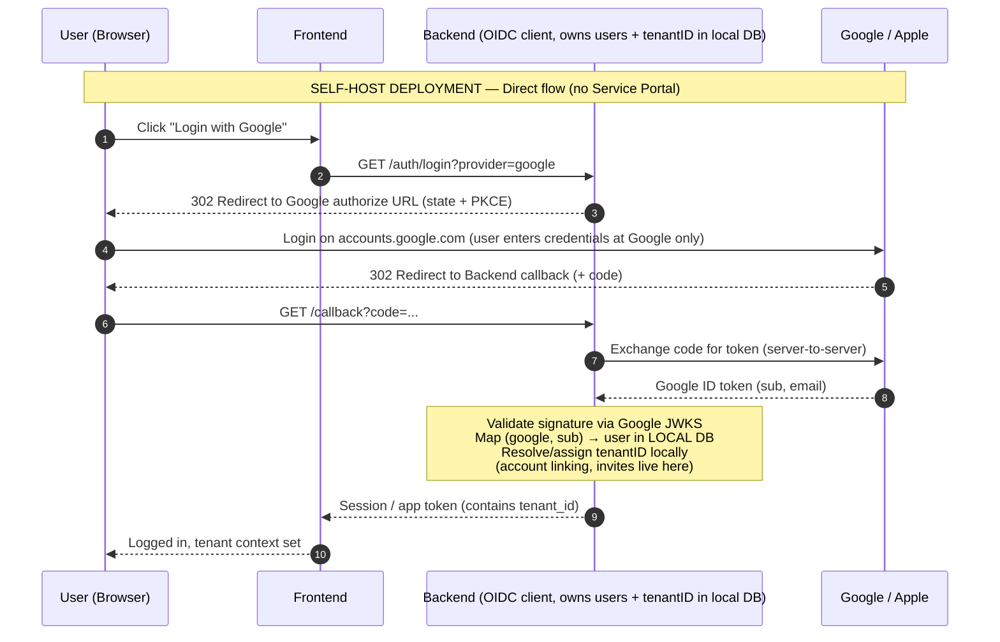
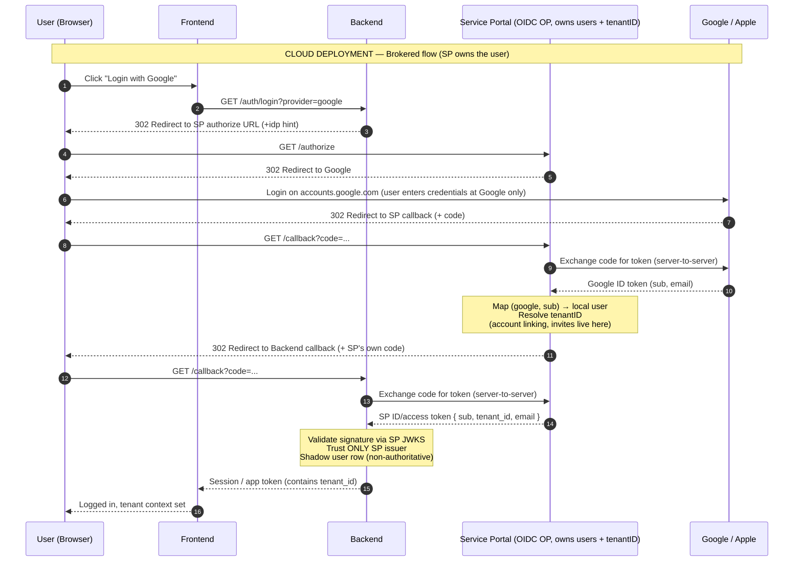
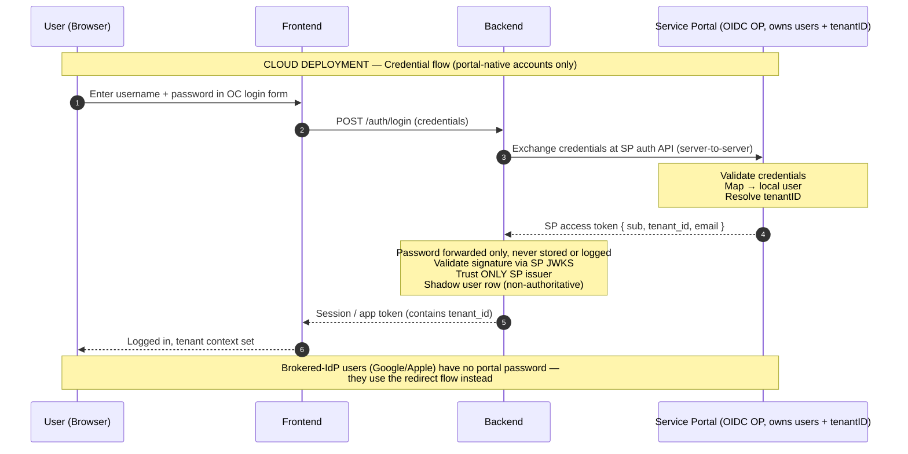

# Security — authentication flow diagrams

Login sequence diagrams behind architecture decision #10 (pluggable authentication,
separate from authorization) and roadmap story ST-03 "Authentication (OIDC + portal)".

This README is the single source of truth for these diagrams — Jira tickets link here
(branch URL, not commit-pinned) instead of attaching snapshots; a diagram change is one
edit in this file. To export a diagram (PNG for a slide, mermaid-cli, draw.io), copy the
fenced block content.

Common to all flows: authentication produces a verified principal (identity, tenant ID,
groups), and core always issues its own session/app JWT carrying the tenant ID —
IdP/portal tokens never reach the frontend.

Status: the portal's OIDC-OP role and its credential-login API require portal-side
changes — PM confirmation pending.

## Self-hosted — direct flow

Core is the OIDC client against any IdP (Authorization Code + PKCE). Users, tenant,
account linking and invites live in core's local DB.

## Cloud — redirect flow (brokered)

The Service Portal is the OIDC OP — it authenticates users itself (portal-native
credentials) or brokers Google/Apple. Core trusts only the portal issuer and keeps a
non-authoritative shadow user row.

## Cloud — credential flow (portal-native accounts only)

Username/password entered in the OpenCelium login form; core exchanges them at the
portal's auth API for the token + claims. Brokered-IdP users have no portal password and
use the redirect flow instead.

