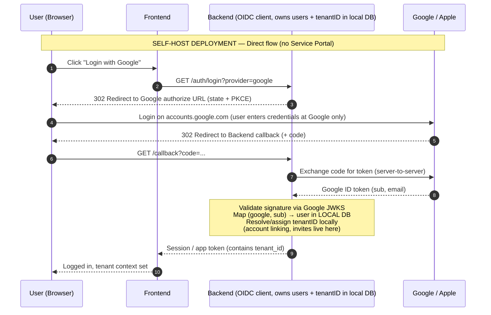
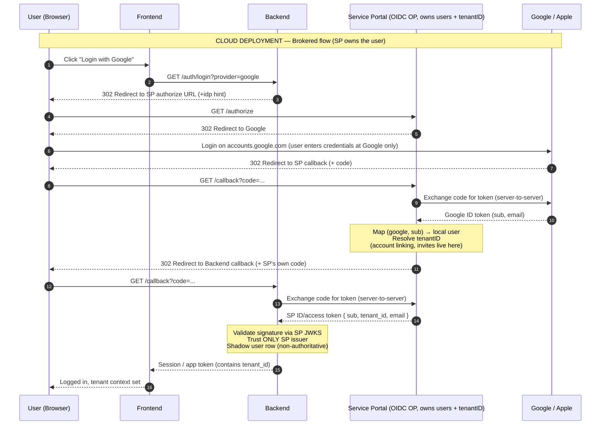
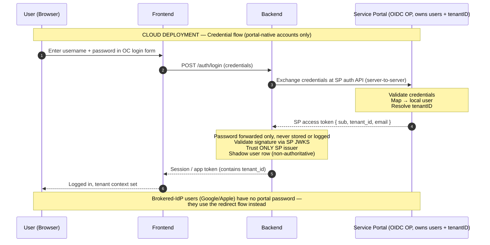

# Authentication flows

The 3 login flows of the backend, as sequence diagrams. The rules behind them are in [architecture.md, section 6.7](../architecture.md#67-authentication-and-authorization) and in decision 10.

Common to all flows: authentication produces a verified principal (identity, tenant ID, groups). Core always issues its own session JWT, which carries the tenant ID. IdP and portal tokens do not reach the frontend.

## Self-hosted: direct flow

Core is the OIDC client against any IdP (Authorization Code + PKCE). The users, the tenant, the account linking, and the invites are in the local database of core.

```mermaid
sequenceDiagram
    autonumber
    participant U as User (Browser)
    participant FE as Frontend
    participant BE as Backend (OIDC client, owns users + tenantID in local DB)
    participant G as Google / Apple

    Note over U,G: SELF-HOST DEPLOYMENT — Direct flow (no Service Portal)

    U->>FE: Click "Login with Google"
    FE->>BE: GET /auth/login?provider=google
    BE-->>U: 302 Redirect to Google authorize URL (state + PKCE)
    U->>G: Login on accounts.google.com (user enters credentials at Google only)
    G-->>U: 302 Redirect to Backend callback (+ code)
    U->>BE: GET /callback?code=...
    BE->>G: Exchange code for token (server-to-server)
    G-->>BE: Google ID token (sub, email)
    Note over BE: Validate signature via Google JWKS<br/>Map (google, sub) → user in LOCAL DB<br/>Resolve/assign tenantID locally<br/>(account linking, invites live here)
    BE-->>FE: Session / app token (contains tenant_id)
    FE-->>U: Logged in, tenant context set
```

## Cloud: redirect flow (brokered)

The Service Portal is the OIDC OP. It authenticates the users itself (portal-native credentials) or brokers Google and Apple. Core trusts only the portal issuer and keeps a non-authoritative shadow user row.

```mermaid
sequenceDiagram
    autonumber
    participant U as User (Browser)
    participant FE as Frontend
    participant BE as Backend
    participant SP as Service Portal (OIDC OP, owns users + tenantID)
    participant G as Google / Apple

    Note over U,G: CLOUD DEPLOYMENT — Brokered flow (SP owns the user)

    U->>FE: Click "Login with Google"
    FE->>BE: GET /auth/login?provider=google
    BE-->>U: 302 Redirect to SP authorize URL (+idp hint)
    U->>SP: GET /authorize
    SP-->>U: 302 Redirect to Google
    U->>G: Login on accounts.google.com (user enters credentials at Google only)
    G-->>U: 302 Redirect to SP callback (+ code)
    U->>SP: GET /callback?code=...
    SP->>G: Exchange code for token (server-to-server)
    G-->>SP: Google ID token (sub, email)
    Note over SP: Map (google, sub) → local user<br/>Resolve tenantID<br/>(account linking, invites live here)
    SP-->>U: 302 Redirect to Backend callback (+ SP's own code)
    U->>BE: GET /callback?code=...
    BE->>SP: Exchange code for token (server-to-server)
    SP-->>BE: SP ID/access token { sub, tenant_id, email }
    Note over BE: Validate signature via SP JWKS<br/>Trust ONLY SP issuer<br/>Shadow user row (non-authoritative)
    BE-->>FE: Session / app token (contains tenant_id)
    FE-->>U: Logged in, tenant context set
```

## Cloud: credential flow (portal-native accounts only)

The user enters a user name and a password in the OpenCelium login form. Core exchanges them at the authentication API of the portal for the token and the claims. Brokered-IdP users have no portal password and use the redirect flow instead.

```mermaid
sequenceDiagram
    autonumber
    participant U as User (Browser)
    participant FE as Frontend
    participant BE as Backend
    participant SP as Service Portal (OIDC OP, owns users + tenantID)

    Note over U,SP: CLOUD DEPLOYMENT — Credential flow (portal-native accounts only)

    U->>FE: Enter username + password in OC login form
    FE->>BE: POST /auth/login (credentials)
    BE->>SP: Exchange credentials at SP auth API (server-to-server)
    Note over SP: Validate credentials<br/>Map → local user<br/>Resolve tenantID
    SP-->>BE: SP access token { sub, tenant_id, email }
    Note over BE: Password forwarded only, never stored or logged<br/>Validate signature via SP JWKS<br/>Trust ONLY SP issuer<br/>Shadow user row (non-authoritative)
    BE-->>FE: Session / app token (contains tenant_id)
    FE-->>U: Logged in, tenant context set

    Note over U,SP: Brokered-IdP users (Google/Apple) have no portal password —<br/>they use the redirect flow instead
```
