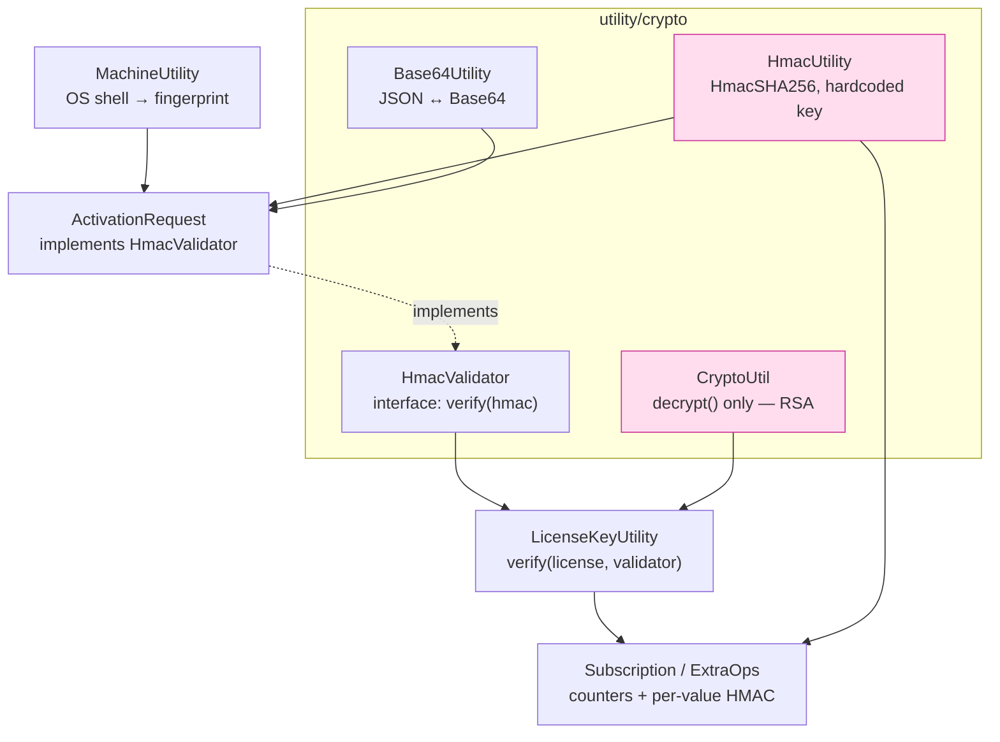
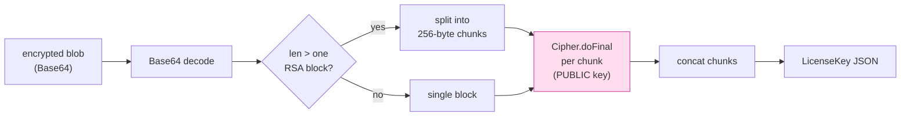
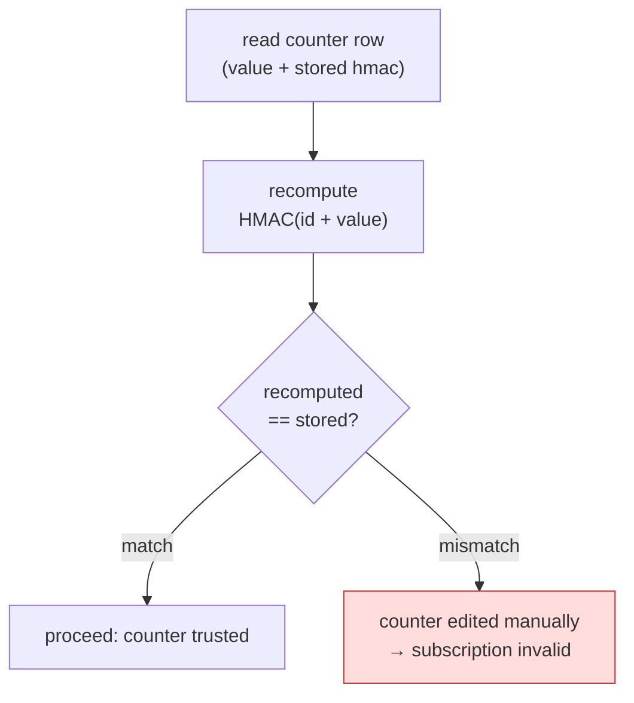
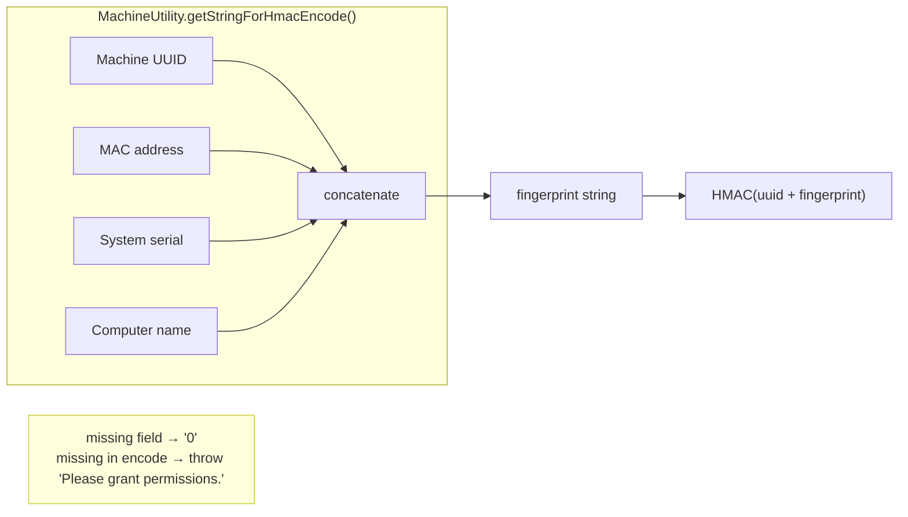
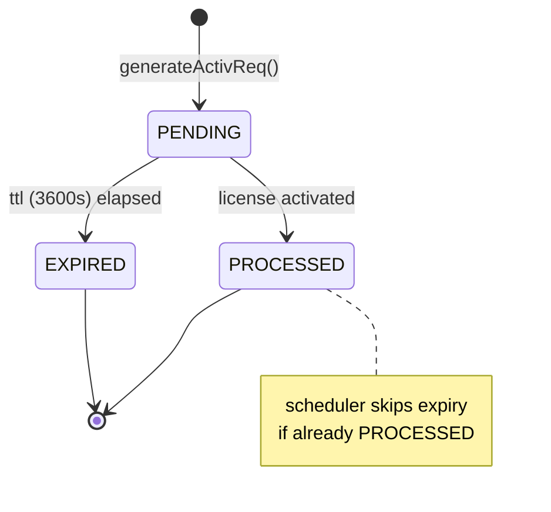
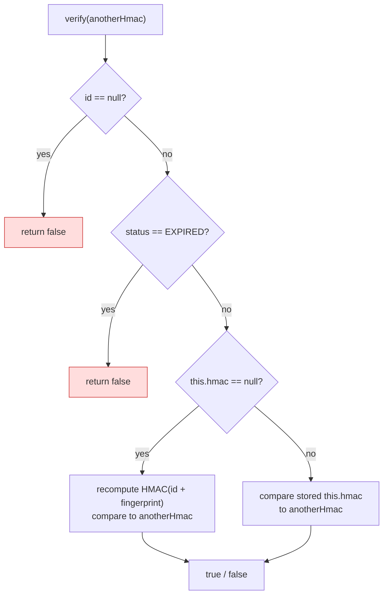

# License Activation & Cryptography — Technical Documentation

This document describes the four cryptographic primitives behind OpenCelium's
license activation, how they combine, and where their security boundaries lie.

The system splits into **two independent mechanisms** plus one transport layer:

| Layer | Primitive | Purpose | Security role |
|---|---|---|---|
| Authenticity | RSA 2048 (verify-only) | Prove the Service Portal issued the license | Signature / integrity |
| Binding & tamper | HMAC-SHA256 | Bind a license to one machine; detect counter edits | Integrity (weak: hardcoded key) |
| Transport | Base64 + JSON | Move the activation-request file around | **None** |
| Identity | Machine fingerprint | Derive a per-host value to bind against | Input to HMAC |

---

## 1. Component map



---

## 2. RSA — license authenticity (verify-only)

**File:** `utility/crypto/CryptoUtil.java`

There is **no `encrypt` method in the backend — only `decrypt`**. This *is* the
trust model: the Service Portal encrypts/signs with its **private key**, and the
backend can only **decrypt with the bundled public key**
(`SecurityConstant.PUBLIC_KEY`, a hardcoded Base64 X509 constant).

- **Algorithm:** `RSA/ECB/PKCS1Padding`, 2048-bit (PKCS#1 v1.5, not OAEP).
- **Chunking:** a license JSON exceeds one RSA block, so ciphertext is split into
  256-byte blocks, each `doFinal`-ed and concatenated.
- **Implication:** this is a *signature* scheme, not confidentiality. Anyone with
  the public key can read a license's contents (dates, quota). What they cannot do
  is forge a blob that decrypts cleanly — only the portal's private key produces
  one. So RSA guarantees **authenticity/integrity**, not secrecy.

The same `decrypt` is reused for ExtraOps files (`ExtraOpsServiceImp.decrypt`).



---

## 3. Base64 — transport only (not encryption)

**File:** `utility/crypto/Base64Utility.java`

Despite living in the `crypto` package, this is **not security**. It is JSON ↔
Base64 via a Jackson `ObjectMapper` (custom `Instant` serializers):

```
encode(T obj) → objectMapper.writeValueAsString(obj) → Base64 encode
decode(s, T)  → Base64 decode → objectMapper.readValue(...)
```

This produces the **activation-request file** the user downloads: a Base64-encoded
JSON of the `ActivationRequestDTO` — **plaintext, readable, editable**. Its
integrity comes entirely from the embedded HMAC (next section), not this encoding.

> Note: `Base64Utility` swallows errors (`printStackTrace` + returns `null`),
> which is worth hardening but out of scope for the current fix.

---

## 4. HMAC — machine binding + tamper detection

**File:** `utility/crypto/HmacUtility.java`

```
HMAC_ALGO  = "HmacSHA256"
SECRET_KEY = "my-secret-key"     ⚠ hardcoded source constant
```

HMAC-SHA256 keyed with a hardcoded secret. It does two jobs.

### (a) Usage tamper detection

Every mutable counter is stored alongside `HMAC(identifier + value)`:

- `Subscription.currentUsageHmac = encode(subscription.id + currentUsage)`
- `ExtraOps` current/total = `encode(licenseId + generatedAt + usage)`
  (`ExtraOpsServiceImp.constructHmac`)

On every read-for-write the HMAC is recomputed and compared. A mismatch ⇒
"changed manually" ⇒ subscription invalid.



### (b) The `HmacValidator` strategy

```java
public interface HmacValidator { boolean verify(String hmac); }
```

`ActivationRequest implements HmacValidator`. `LicenseKeyUtility.verify(licenseKey,
hmacValidator)` passes the **ActivationRequest as the validator** and checks
`hmacValidator.verify(licenseKey.getHmac())` — i.e. *does the license's embedded
HMAC equal the activation request's HMAC?* That equality is what **binds a license
to a specific machine**.

> ⚠ Because `SECRET_KEY` is a source constant, this HMAC layer catches *accidental*
> DB edits but offers no real defense against a determined attacker — they can
> recompute any HMAC. This is the system's main security weakness.

---

## 5. Machine fingerprint

**File:** `utility/MachineUtility.java`

`getStringForHmacEncode()` concatenates four host identifiers, each read via an
**OS shell command**:

| Field | Windows | macOS | Linux |
|---|---|---|---|
| Machine UUID | `wmic csproduct get UUID` | `system_profiler … Hardware UUID` | `sudo dmidecode -s system-uuid` |
| MAC address | Java `NetworkInterface` | same | same |
| System UUID | `wmic bios get serialnumber` | `system_profiler … Serial` | `sudo dmidecode -s system-serial-number` |
| Computer name | Java `InetAddress.getHostName()` | same | same |

Missing values degrade to `"0"`; missing values inside `getStringForHmacEncode()`
throw `"Please grant permissions."` (note the Linux `sudo dmidecode` dependency).

The `ActivationRequest` entity stores only `id, createdAt, hmac, ttl, status,
active`. The four machine fields are **`@Transient`** — not persisted — and
initialized at construction from `MachineUtility`. The machine identity is *not*
stored as columns; it is compressed into the `hmac`.



---

## 6. Activation request lifecycle (TTL)

**Service:** `ActivationRequestServiceImp.java`

Generation (`generateActivReq`):

```java
ar.setId(UUID.randomUUID().toString());
ar.setTtl(3600);
ar.setStatus(PENDING);
ar.setHmac(HmacUtility.encode(ar.getId() + MachineUtility.getStringForHmacEncode()));
// hmac = HMAC(uuid + machineFingerprint)
```

TTL expiry (`activateTTL`) uses a plain `ScheduledExecutorService` (not Quartz) to
flip `PENDING → EXPIRED` after `ttl` seconds — *unless* it was already `PROCESSED`.



The binding check (`ActivationRequest.verify`):



> **Free / offline default:** `SubscriptionConstant.DEFAULT_AR` is a Base64 JSON of
> a canned activation request (placeholder `MACHINE_UUID`, etc.), decoded by
> `readFreeAR()` for the free-license flow.

---

## 7. End-to-end activation flow

```mermaid
sequenceDiagram
    participant BE as Backend
    participant SP as Service Portal
    Note over BE: MachineUtility reads UUID/MAC/serial/name
    BE->>BE: ar.hmac = HMAC(uuid + fingerprint)
    BE->>BE: Base64Utility.encode(ar) → activation-request.txt (plaintext JSON)
    BE->>SP: send activation request
    Note over SP: signs license with PRIVATE key,<br/>embeds ar.hmac into the license
    SP-->>BE: encrypted license blob
    BE->>BE: CryptoUtil.decrypt(blob, PUBLIC_KEY) → LicenseKey  (RSA authenticity)
    BE->>BE: LicenseKeyUtility.verify(lk, activationRequest)
    Note over BE: HmacValidator: lk.hmac == ar.hmac ?  (machine binding)<br/>+ startDate/endDate window check
    BE->>BE: store Subscription; currentUsageHmac = HMAC(id + 0)  (tamper seal)
```

**Chain of trust:**

1. **RSA** proves the portal issued the license.
2. **HMAC equality** proves it was issued for *this* activation request (machine).
3. **Per-counter HMACs** prove usage wasn't edited afterward.
4. **Base64** just moves the request file around — no security role.

---

## 8. Security caveats

- **Hardcoded HMAC secret** (`"my-secret-key"`) — the tamper/binding HMACs are
  forgeable by anyone with the source. Biggest weakness.
- **RSA gives integrity, not confidentiality** — license contents are readable by
  anyone holding the public key (which ships in the jar). Expected for a signature
  scheme, but worth knowing.
- **Activation-request file is plaintext** — only the HMAC protects it.
- **Fingerprint fragility** — shell-command based; `sudo dmidecode` on Linux can
  fail, and fields silently fall back to `"0"`, weakening uniqueness.
- **Error handling** — `Base64Utility` swallows errors (`printStackTrace` + returns
  `null`); `MachineUtility` runs shell commands. Both worth hardening.