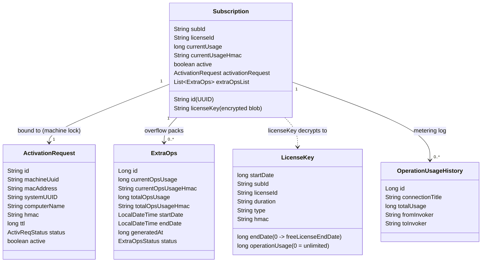
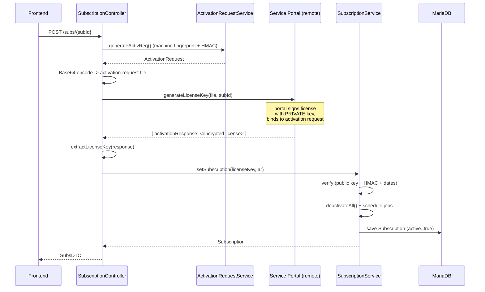
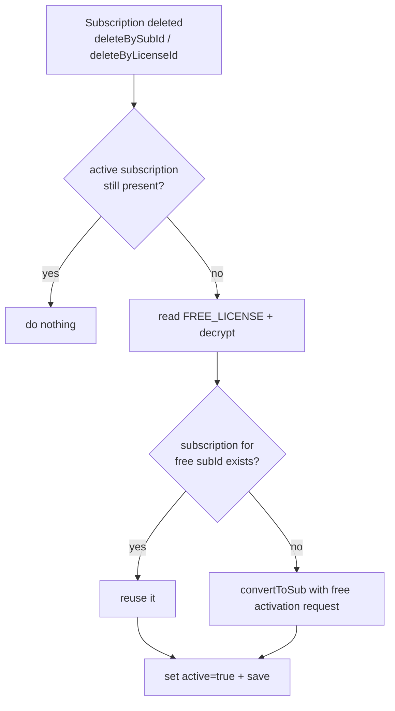
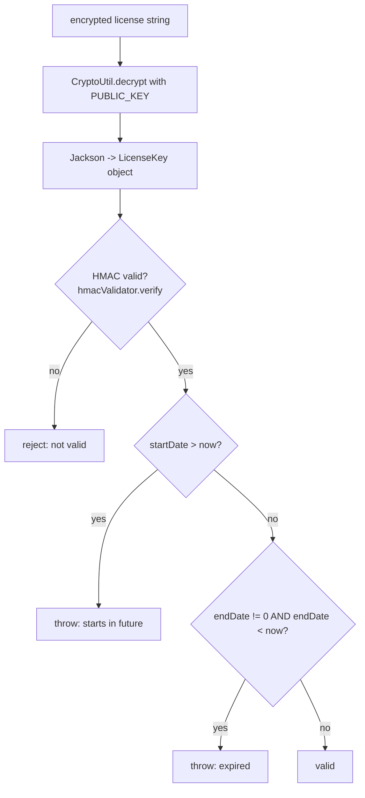
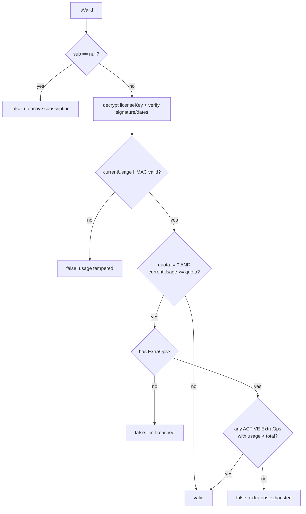
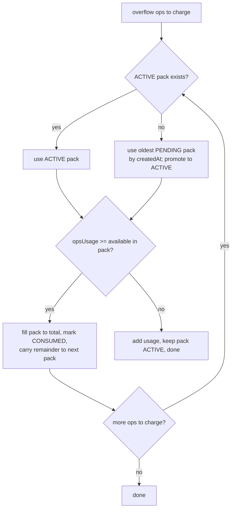
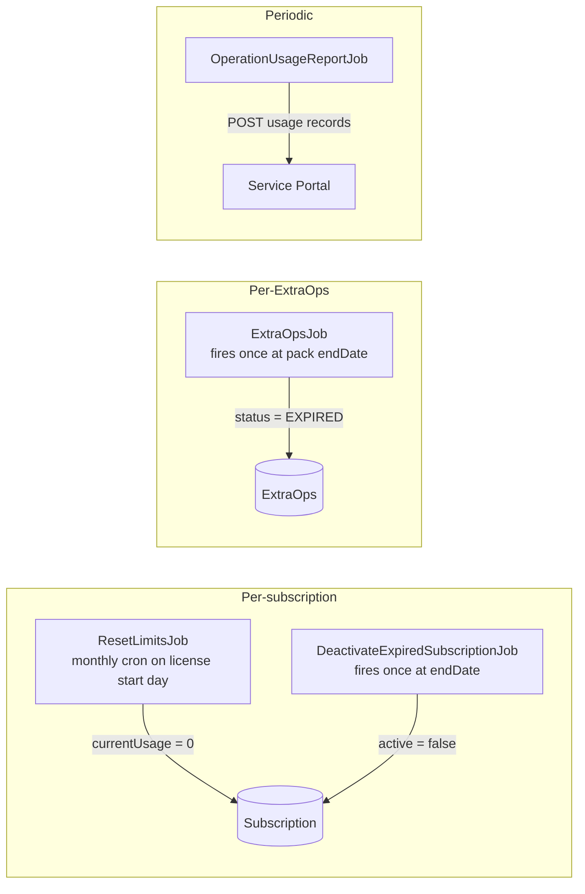
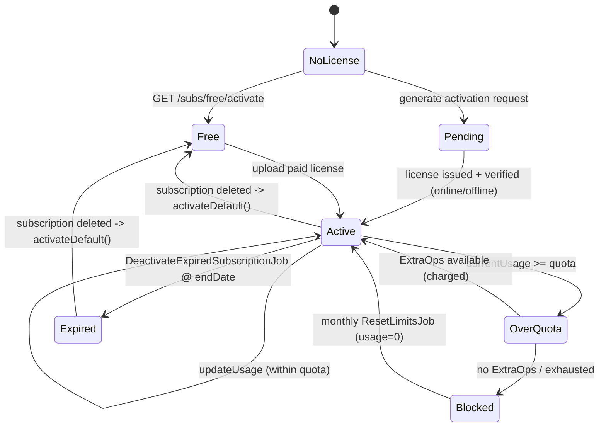

# Subscription & Licensing — Process Documentation

> Scope: backend subscription/licensing subsystem. Explains the domain model, the
> activation flows (online / offline / free), runtime metering and enforcement,
> tamper protection, and the scheduled jobs. Diagrams are Mermaid (render in any
> Mermaid-aware viewer, e.g. GitHub, IntelliJ Markdown, VS Code).

---

## 1. What this subsystem does

OpenCelium gates **how many operations a customer may run** against a
cryptographically signed **license** issued by an external **Service Portal**.
It is a *metering / entitlement* system, not a payment system.

Key properties:

- A license is **machine-locked** — bound to an *activation request* that
  fingerprints the host (MAC, system UUID, machine UUID, computer name).
- A license is **signed by the portal's private key** and verified locally with
  an embedded **public key**, so a client cannot forge or edit one.
- Usage counters are protected by **HMAC** so a manual DB edit invalidates the
  subscription (tamper detection).
- Expiry and monthly quota resets are driven by **Quartz** jobs.
- The system is **never license-less**: deleting a subscription falls back to a
  hardcoded **free license** (valid until ~year 2100).

---

## 2. Where the code lives

The `subscription/` package only holds DTOs, the status enum, Quartz jobs, and
utilities. The stateful parts live in the standard MariaDB/JPA and controller
packages.

| Concern | Location |
|---|---|
| DTOs / enum / utils / jobs | `subscription/` |
| Entities (`Subscription`, `ExtraOps`, `OperationUsageHistory`) | `database/mysql/entity/` |
| Service logic | `database/mysql/service/SubscriptionServiceImpl`, `ExtraOpsServiceImp` |
| Repositories | `database/mysql/repository/SubscriptionRepository`, `ExtraOpsRepository` |
| REST API | `controller/SubscriptionController` |
| External API client | `api/module/SubscriptionModuleImpl` → Service Portal |
| Crypto / HMAC | `utility/crypto/{CryptoUtil,HmacUtility,HmacValidator}` |
| Expiry job | `quartz/DeactivateExpiredSubscriptionJob` |
| Monthly reset job | `quartz/ResetLimitsJob` |

---

## 3. Domain model



**Concept glossary**

- **LicenseKey** — decrypted view of the signed license blob. `operationUsage` is
  the quota (`0` = unlimited). `endDate == 0` is normalized to `freeLicenseEndDate`.
- **ActivationRequest** — host fingerprint + HMAC + TTL. The license is issued
  *against* this, locking it to the machine.
- **Subscription** — local persisted state; only **one is `active` at a time**.
- **ExtraOps** — add-on operation packs consumed once the base quota is exhausted.
  Lifecycle: `PENDING → ACTIVE → CONSUMED | EXPIRED`.
- **OperationUsageHistory / …Detail** — per-connection metering log, periodically
  reported back to the Service Portal.

---

## 4. Activation flows

There are three ways a subscription becomes active.

### 4.1 Online activation



### 4.2 Offline activation (air-gapped)

Two HTTP calls with a manual portal step in between.

```mermaid
sequenceDiagram
    participant FE as Frontend
    participant C as SubscriptionController
    participant AR as ActivationRequestService
    participant SP as Service Portal (manual, out-of-band)
    participant S as SubscriptionService

    rect rgb(235,245,255)
    Note over FE,C: Step 1 — export request
    FE->>C: GET /subs/activation/request/generate
    C->>AR: generateActivReq() + save + activateTTL()
    C-->>FE: activation-request.txt (download)
    end

    Note over FE,SP: User uploads file to portal,<br/>downloads license file

    rect rgb(235,255,235)
    Note over FE,C: Step 2 — import license
    FE->>C: POST /subs/activate/license (multipart file)
    C->>C: LicenseKeyUtility.decrypt(content)
    C->>AR: findByHmac(license.hmac)  (match to request)
    C->>C: LicenseKeyUtility.verify(lk, ar)
    C->>AR: deactivateAll(); ar.status=PROCESSED; active=true
    C->>S: convertToSub(content, ar) + save
    C-->>FE: 200 OK
    end
```

### 4.3 Free / default license

- `GET /subs/free/activate` installs the hardcoded `SubscriptionConstant.FREE_LICENSE`
  (end date `4102441199000L` ≈ year 2100, effectively non-expiring).
- Whenever a subscription is **deleted**, `activateDefault()` reinstalls the free
  license so the platform is never without an active entitlement.



---

## 5. License verification

Every license passes through `LicenseKeyUtility`:



The HMAC validator passed in is the **ActivationRequest** itself — it implements
`HmacValidator`, so verification also confirms the license is bound to *this
machine's* activation request.

---

## 6. Runtime metering & enforcement

Two service methods carry the runtime logic.

### 6.1 Pre-execution gate — `isValid(Subscription)`



### 6.2 Post-execution accounting — `updateUsage(...)`

Runs under a **pessimistic write lock** (`findAndLockById`) to prevent concurrent
executions from racing on the counter.

```mermaid
sequenceDiagram
    participant EX as Execution pipeline
    participant S as SubscriptionService
    participant H as OperationUsageHistoryService
    participant E as ExtraOpsService
    participant WS as WebSocket queue

    EX->>S: updateUsage(subId, connectionEx, opsUsage, startTime)
    S->>S: findAndLockById(subId)  (PESSIMISTIC_WRITE)
    S->>H: find/increment OperationUsageHistory + add detail
    S->>S: re-check currentUsage HMAC (tamper)
    S->>S: updated = currentUsage + opsUsage ; remain = quota - updated
    alt currentUsage < quota
        S->>S: clamp currentUsage to quota ceiling + new HMAC
    end
    alt remain <= 0 (quota exceeded)
        S->>E: updateExtraOpsForSubscription(sub, |remain|)
        Note over E: drain ACTIVE then oldest PENDING packs;<br/>mark CONSUMED as each fills
    end
    S->>WS: sendNotification (push SubsDTO to frontend)
```

### 6.3 ExtraOps consumption order



> ⚠️ **Known issue (see §9):** the remainder carry in `updateExtraOpsForSubscription`
> computes `opsUsage = availableOps - opsUsage` (sign inverted). The loop then exits
> early and overflow does **not** cascade to the next pack. Documented here as
> current behavior, not intended behavior.

---

## 7. Tamper protection (HMAC)

Every mutable counter is paired with an HMAC over `(identifier + value)`:

| Field | HMAC seed |
|---|---|
| `Subscription.currentUsage` | `subscription.id + currentUsage` |
| `ExtraOps.currentOpsUsage` | `licenseId + generatedAt + usage` |
| `ExtraOps.totalOpsUsage` | `licenseId + generatedAt + usage` |
| License integrity | license `hmac` verified against ActivationRequest |

On every read-for-write, the stored HMAC is recomputed and compared. A mismatch
means the value was edited directly in the DB → the subscription is treated as
invalid and execution is blocked.

---

## 8. Scheduled jobs (Quartz, JDBC store)



- **ResetLimitsJob** — cron anchored to the license start day-of-month (clamped for
  short months via `generateCronExpression`); zeroes `currentUsage` + refreshes HMAC.
- **DeactivateExpiredSubscriptionJob** — one-shot at `endDate`; flips `active=false`.
  Skipped for the free license (`endDate == freeLicenseEndDate`).
- **ExtraOpsJob** — one-shot at each pack's `endDate`; marks it `EXPIRED`.
- **OperationUsageReportJob** — ships `OperationUsageHistory` back to the portal for
  billing reconciliation; no-op when there's nothing to report.
- **QuartzCronUpdater** — helper to reschedule a trigger's cron expression.

Job groups: `LicenseJobs` / `LicenseExpiryJobs` / `ExtraOpsJobs`. On reactivation,
`killAllTasks()` clears the license job groups before scheduling new ones.

---

## 9. End-to-end lifecycle (the big picture)



---

## 10. REST API surface (`/subs`)

| Method & path | Purpose |
|---|---|
| `GET /subs/all` | List subscriptions from the Service Portal (online) |
| `GET /subs/connection/check` | Portal reachability check |
| `GET /subs/{subId}` | Fetch a subscription from the portal |
| `POST /subs/{subId}` | **Online activation** |
| `GET /subs/activation/request/generate` | **Offline step 1** — download activation request |
| `POST /subs/activate/license` | **Offline step 2** — upload license file |
| `GET /subs/free/activate` | Activate the free license |
| `GET /subs/active` | Current active subscription (`SubsDTO`) |
| `GET /subs/valid/activation-request` | Current valid activation request |
| `GET /subs/operation/usage` | Paginated usage history |
| `GET /subs/operation/usage/{usageId}/details` | Paginated usage detail rows |
| `DELETE /subs/{subId}` | Delete by subId → re-activates free license |
| `DELETE /subs/license/{licenseId}` | Delete by licenseId → re-activates free license |

---

## 11. Notes / observations

These are current-state observations, not part of the intended design:

- **ExtraOps overflow carry bug** — `ExtraOpsServiceImp.updateExtraOpsForSubscription`
  computes the remainder with an inverted sign (`availableOps - opsUsage`), so
  overflow does not cascade to the next pack. (§6.3)
- **Code style drift from `CLAUDE.md`** — DTOs are mutable getter/setter classes
  rather than records; `QuartzCronUpdater` / `OperationUsageReportJob` use
  `System.out.println` / `printStackTrace` / `@Autowired` instead of constructor
  injection + SLF4J. Several commented-out dead-code blocks remain.
- **Thin test coverage** — only `LicenseKeyUtilityTest` exists; the metering logic
  in `SubscriptionServiceImpl` / `ExtraOpsServiceImp` (the highest-risk code) is
  untested.
```
